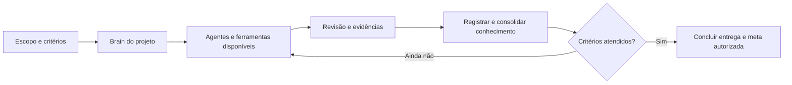

# HeBe Orchestrator for Codex

**Versão 0.5.0** — orquestração com modelos disponíveis, metas verificáveis e memória por projeto/subprojeto.

O HeBeBrain é a opção principal para organizar conhecimento. Quem já usa Obsidian pode reaproveitar o vault ou abrir a mesma base nas duas interfaces. Cada projeto mantém seu próprio Brain; a central relaciona as fontes e o conhecimento transversal.

## Instalar no Codex

Este repositório é um marketplace de plugins. É necessário Codex com suporte a plugins e acesso Git ao repositório. Se ele estiver privado, o proprietário precisa conceder acesso a cada parceiro.

```sh
codex plugin marketplace add HericlisBezerra/hebe-orchestrate-Codex --ref main
codex plugin add hebe-orchestrator-codex@hebe-codex
```

Abra uma nova conversa na pasta do seu projeto e peça:

> Use $orchestrate-models para mostrar o mapa e configurar meu HeBeBrain, GitHub e as integrações disponíveis.

O onboarding acontece na conversa quando a skill é carregada. Ele reaproveita escolhas existentes, sugere a [skill hebe-brain](https://github.com/HericlisBezerra/hebe-brain) quando faltar, define a raiz central e distingue integrações disponíveis das próximas etapas. Instalar a skill não instala o visualizador HeBeBrain.

### Acesso ao GitHub

Autenticar a conta e instalar um plugin não libera automaticamente todos os repositórios privados. Confira se o ChatGPT Codex Connector está instalado na conta/organização proprietária e se inclui os repositórios necessários. Com “Only select repositories”, novos repositórios precisam ser adicionados; “All repositories” inclui atuais e futuros daquela conta.

O conector do Codex e a autenticação do Git no terminal são mecanismos separados. Se a CLI pedir autenticação ao buscar este marketplace, use a configuração Git habitual da sua máquina; nunca inclua tokens em URLs, documentação ou commits.

## Mapa da entrega



## O que está incluído

- Skill de orquestração e onboarding de HeBeBrain, Obsidian, GitHub e opção Jev.
- Núcleo Python local: cadastro com UUID, relações entre projetos, eventos, proveniência e consolidação Markdown.
- Coleta explícita de commits Git por caminho.
- Perfis de modelos e orientação para metas nativas e revisão proporcional ao risco.
- Conector TypeSafe/Jev: configuração local da chave, catálogo de modelos e avaliações explícitas.
- Mapas, arquitetura, exemplos e testes existentes do núcleo.

**Próximas etapas:** captura contínua de conversas, worker permanente, sincronização automática GitHub, recuperação automática com Jev e runner Claude. A instalação não ativa esses recursos.

## Conectar sua chave TypeSafe/Jev

Na pasta `plugins/hebe-orchestrator-codex`, rode `python3 scripts/jev.py configure --web`. Abra o endereço local exibido, cole a chave no campo **Chave da API TypeSafe** e clique em **Conectar**. O catálogo oficial é consultado antes de salvar a credencial; nenhuma nota é enviada nesse passo.

A credencial fica em `~/.config/hebe-brain/typesafe.json` com acesso restrito ao usuário. A variável `TYPESAFE_API_KEY` também é aceita e tem precedência. Os comandos `status`, `models` e `evaluate --file` estão descritos no [guia do plugin](plugins/hebe-orchestrator-codex/README.md#conectar-typesafejev).

A skill oficial TypeSafe é opcional como apoio ao desenvolvimento: `npx skills add typesafe-ai/skills --skill typesafe-ai` na pasta de trabalho, selecionando Codex. Ela não contém credenciais e não faz chamadas por ser instalada.

## Documentação

- [Mapa completo e primeira configuração](plugins/hebe-orchestrator-codex/docs/MAPA-DO-PROJETO.md)
- [Guia do plugin e comandos do núcleo](plugins/hebe-orchestrator-codex/README.md)
- [Arquitetura e evolução](plugins/hebe-orchestrator-codex/docs/ORCHESTRATOR-EVOLUCAO.md)
- [Histórico de versões](plugins/hebe-orchestrator-codex/CHANGELOG.md)

Para usar os exemplos do núcleo a partir deste checkout, entre primeiro em `plugins/hebe-orchestrator-codex`. O núcleo requer Python 3.10+ em macOS/Linux; a coleta de commits requer Git. A conta e o host determinam os modelos, os esforços, as ferramentas e a concorrência efetivamente disponíveis.

Este repositório distribui código e instruções. Não inclui vaults pessoais, conversas, credenciais, bancos de uso ou configurações de usuários.

## Licença

MIT — [LICENSE](LICENSE).
