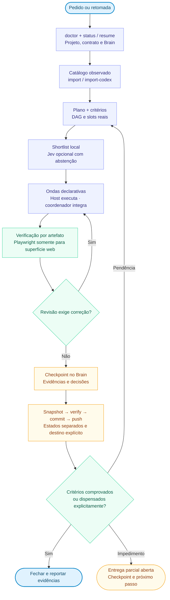

# HeBe Orchestrator for Codex

**Versão 0.8.0.** Coordenação de entregas com retomada por projeto, critérios verificáveis, catálogo de modelos observado, planejamento de DAG em ondas, reranking Jev e snapshots restauráveis do HeBeBrain com sync Git explícito. `AGENTS.md` compartilha o contrato entre Codex, Claude Code e Grok; cada host conserva seus modelos, ferramentas e limites.

HeBeBrain é a opção principal de organização. Obsidian existente pode abrir a mesma base Markdown. A [skill hebe-brain](https://github.com/HericlisBezerra/hebe-brain) e o visualizador são componentes separados; este plugin inclui o núcleo de memória, a rotina local e a skill de coordenação.

## Instalar no Codex

Este repositório é um marketplace de plugins. No Codex com suporte a plugins, rode:

```sh
codex plugin marketplace add HericlisBezerra/hebe-orchestrate-Codex --ref main
codex plugin add hebe-orchestrator-codex@hebe-codex
```

Abra uma nova conversa na pasta do projeto para carregar a versão instalada. O onboarding reaproveita escolhas existentes e sugere a [skill hebe-brain](https://github.com/HericlisBezerra/hebe-brain) quando ela faltar.

### Acesso ao GitHub

O ChatGPT Codex Connector e o Git do terminal têm autenticações separadas. O connector precisa incluir os repositórios necessários; o sync do Brain usa o credential helper ou agente SSH do Git em um checkout privado dedicado. Nunca coloque tokens em URLs, Brain, documentação ou commits.

## Começar ou retomar

Com o plugin carregado, peça:

> Use $orchestrate-models para conferir o projeto, retomar a entrega aberta e avançar no próximo critério pendente.

Para a primeira configuração completa:

> Use $orchestrate-models para mostrar o mapa e configurar HeBeBrain, GitHub e a opção Jev, reaproveitando minhas escolhas existentes.

A entrada rápida resolve apenas o que falta para o trabalho atual. GitHub, Jev, Obsidian e meta nativa são opcionais. Instalar o plugin não abre um assistente, ativa um runner ou inicia captura contínua.

O mapa abaixo é a arquitetura completa. A execução diária usa o menor percurso suficiente: tarefa simples vai direto ao artefato; entrega composta usa estado e poucos agentes; catálogo, DAG, Jev, revisão dedicada e sync entram somente quando o caso os aciona. Isso evita transformar toda solicitação no custo máximo do orquestrador.

## Mapa vertical



O [mapa completo](plugins/hebe-orchestrator-codex/docs/MAPA-DO-PROJETO.md) detalha descoberta de modelos, ondas, confiança do Jev, revisão, Brain e recuperação. O [onboarding](plugins/hebe-orchestrator-codex/skills/orchestrate-models/references/onboarding.md) distingue entrada rápida e configuração completa.

## Estado da versão

| Recurso | Estado na 0.8.0 |
|---|---|
| Rotina local | `orchestrator.py`: `configure`, `doctor`, `start`, `status`, `resume`, `update`, `checkpoint` e `close` |
| Retomada | Configuração persistente e uma entrega ativa por projeto, com objetivo, critérios, frentes, impedimentos e próximo passo |
| Diagnóstico do contrato | Presença e aplicabilidade observáveis; `host_loaded: unknown` sem introspecção do host |
| Brain e proveniência | UUIDs, relações explícitas, eventos SQLite, consolidação Markdown, origem do host e estados distintos de commit, push e publicação |
| Modelos | `model_registry.py` registra snapshots observados e normaliza `model/list`; IDs novos e upgrades viram candidatos, sem promoção silenciosa |
| Escala | `batch_scheduler.py` valida uma DAG e produz ondas determinísticas dentro dos slots globais e por modelo; não lança agentes |
| TypeSafe/Jev | Credencial protegida, chamadas explícitas e `jev_rerank.py` para shortlist local, Noul por candidato, limiar, abstenção e fallback |
| Git e recuperação | `brain_sync.py` exporta snapshots endereçados por conteúdo, verifica, restaura com dry run e sincroniza por checkout Git dedicado |
| Playwright | Detecção, orientação e kit opcional; adaptação e verificação no produto web são necessárias |
| Recursos futuros | Hooks e captura global, recovery automático orientado por Jev, runner Claude e adaptação a protocolos novos dos hosts |

Python 3.10+ e biblioteca padrão em macOS/Linux. Git é necessário para importar commits e sincronizar snapshots; Node e Chromium são necessários no projeto que adotar o kit Playwright. Catálogo, slots e continuidade de execução pertencem ao host.

## Runtime da rotina

Resolver a raiz da instalação ativa. Nos exemplos abaixo, substitua a pasta ilustrativa:

```sh
HEBE_PLUGIN_ROOT="/caminho/instalacao/hebe-orchestrator-codex"
python3 "$HEBE_PLUGIN_ROOT/scripts/orchestrator.py" configure --brain-home /caminho/central
python3 "$HEBE_PLUGIN_ROOT/scripts/orchestrator.py" doctor --path /caminho/projeto
python3 "$HEBE_PLUGIN_ROOT/scripts/orchestrator.py" status --path /caminho/projeto
python3 "$HEBE_PLUGIN_ROOT/scripts/orchestrator.py" resume --path /caminho/projeto
```

A central segue a precedência `--home`, `HEBE_BRAIN_HOME` e configuração persistida. `resume` prepara contexto, sem iniciar agentes ou retomar uma meta nativa automaticamente. `checkpoint` e `close` aceitam a origem e referência observadas com `--source` e `--source-ref`. O [contrato do runtime](plugins/hebe-orchestrator-codex/skills/orchestrate-models/references/daily-runtime.md) descreve os comandos.

`close` exige critérios `passed` ou `waived` com evidência, frentes concluídas e ausência de impedimentos. `waived` registra dispensa explícita com justificativa; não significa teste aprovado. Commit, push e publicação têm evidências próprias e só são realizados quando pertencem ao escopo autorizado.

## Catálogo observado e ondas

O catálogo privado fica em `~/.config/hebe-brain/model-catalog.json`. Importar somente dados efetivamente observados. Para o Codex App Server, salvar a resposta de `model/list` em arquivo regular e normalizá-la com o limite de agentes visto na sessão:

```sh
python3 "$HEBE_PLUGIN_ROOT/scripts/model_registry.py" import-codex --file /caminho/model-list.json --observed-at 2026-09-23T12:00:00Z --max-parallel 3
python3 "$HEBE_PLUGIN_ROOT/scripts/model_registry.py" list
python3 "$HEBE_PLUGIN_ROOT/scripts/model_registry.py" recommend --capability engineering --effort high
```

`recommend` ordena candidatos elegíveis pela política informada; não comprova superioridade. Diferenças de snapshot registram modelos novos, removidos, alterados e upgrades anunciados. Um modelo novo ou `upgradeInfo` pede avaliação representativa antes de mudar a preferência.

Para mais frentes que slots, descreva tarefas, dependências, modelos e limites observados em JSON. O planejador devolve ondas e tarefas bloqueadas:

```sh
python3 "$HEBE_PLUGIN_ROOT/scripts/batch_scheduler.py" --file examples/batch-plan.json
```

O scheduler é declarativo: ele não cria agentes, processos ou jobs. O coordenador executa uma onda por vez com as ferramentas nativas do host, observa o resultado e replana antes da próxima.

## TypeSafe/Jev explícito e reranking

Crie a chave no [console TypeSafe](https://console.typesafe.ai/) e conecte pelo formulário local:

```sh
python3 "$HEBE_PLUGIN_ROOT/scripts/jev.py" status
python3 "$HEBE_PLUGIN_ROOT/scripts/jev.py" configure --web
python3 "$HEBE_PLUGIN_ROOT/scripts/jev.py" models
python3 "$HEBE_PLUGIN_ROOT/scripts/jev_rerank.py" preview --file examples/jev-rerank.json
python3 "$HEBE_PLUGIN_ROOT/scripts/jev_rerank.py" evaluate --file examples/jev-rerank.json --send
```

A chave fica fora do projeto, em `~/.config/hebe-brain/typesafe.json`, com acesso restrito ao usuário; `TYPESAFE_API_KEY` tem precedência. Nunca colocar a chave no chat, argumentos, Brain ou Git. `preview` é local. `evaluate --send` é o único caminho de rede do reranker e autoriza o envio daquela shortlist.

O reranker envia uma pergunta `Noul` independente por candidato, valida a resposta e ordena pela probabilidade. Se a credencial ou o serviço falhar, ou se o maior resultado ficar abaixo do limiar, ele se abstém e conserva a ordem local. Não imprime consulta, textos, metadados nem credenciais. Ver [typesafe-jev.md](plugins/hebe-orchestrator-codex/skills/orchestrate-models/references/typesafe-jev.md).

## Núcleo local, Git e recuperação

```sh
HEBE_BRAIN_HOME="/caminho/central"
python3 "$HEBE_PLUGIN_ROOT/scripts/brain.py" --home "$HEBE_BRAIN_HOME" status
python3 "$HEBE_PLUGIN_ROOT/scripts/brain.py" --home "$HEBE_BRAIN_HOME" init
python3 "$HEBE_PLUGIN_ROOT/scripts/brain.py" --home "$HEBE_BRAIN_HOME" register --path /caminho/produto --name Produto
python3 "$HEBE_PLUGIN_ROOT/scripts/brain.py" --home "$HEBE_BRAIN_HOME" context --path /caminho/produto
```

Usar os UUIDs devolvidos. Registrar subprojetos reais com `--parent UUID-DO-PAI`; a relação não carrega automaticamente o conteúdo dos pais ou irmãos. `record` guarda eventos; `consolidate` aplica notas; `checkpoint` integra o estado da entrega com o Brain. Coletar commits locais com `git_events.py`; commit local não comprova push ou publicação.

O sync exige uma central inicializada e um checkout Git comum, já existente e dedicado exclusivamente ao backup. O CLI não cria repositório, não armazena autenticação e não verifica a privacidade no provedor. Para remoto, o operador precisa confirmar que verificou o destino privado:

```sh
python3 "$HEBE_PLUGIN_ROOT/scripts/brain_sync.py" configure --brain-home "$HEBE_BRAIN_HOME" --checkout /caminho/checkout-dedicado --remote origin --branch main --confirm-private-destination
python3 "$HEBE_PLUGIN_ROOT/scripts/brain_sync.py" status
python3 "$HEBE_PLUGIN_ROOT/scripts/brain_sync.py" export
python3 "$HEBE_PLUGIN_ROOT/scripts/brain_sync.py" verify --snapshot /caminho/checkout-dedicado
python3 "$HEBE_PLUGIN_ROOT/scripts/brain_sync.py" sync
```

`export` cria um snapshot determinístico com documentos selecionados e exportações JSON canônicas dos bancos, além de `CURRENT.json`. `verify` confere integridade e estrutura. `sync` cria commit quando necessário e faz push sem force; divergências ficam visíveis. Autenticação usa o credential helper ou agente SSH já configurado pelo Git.

Restauração é dry run até `--apply` e nunca sobrescreve arquivo divergente:

```sh
python3 "$HEBE_PLUGIN_ROOT/scripts/brain_sync.py" restore --snapshot /caminho/checkout-dedicado --destination /caminho/recuperacao
python3 "$HEBE_PLUGIN_ROOT/scripts/brain_sync.py" restore --snapshot /caminho/checkout-dedicado --destination /caminho/recuperacao --apply
```

Para operação recorrente, `run` permanece em primeiro plano. `install-launchd` sem `--activate` apenas prepara um preview privado; a instalação e inicialização do job exigem `--activate`. Nenhum runner foi ativado só por instalar a versão 0.8.0. Ver [Brain e GitHub](plugins/hebe-orchestrator-codex/skills/orchestrate-models/references/brain-and-github.md).

## Contrato portátil e verificação

`AGENTS.md` é a fonte compartilhada; `CLAUDE.md` importa `@AGENTS.md` para compatibilidade. Um arquivo presente não comprova que entrou no contexto. Use `project_context.py status` e, quando disponível, introspecção do host.

Playwright aplica-se à superfície web. Reutilizar a configuração existente; quando faltar e a validação no navegador for material, `project_context.py web-init --path /caminho/projeto-web` prepara um kit que ainda precisa ser adaptado ao produto.

## Validação e evolução

```sh
python3 -m unittest discover -s tests -v
```

Executar na raiz do plugin e validar também o pacote instalado. Versão declarada, conteúdo do checkout, commit, push e publicação são estados distintos. A [arquitetura de evolução](plugins/hebe-orchestrator-codex/docs/ORCHESTRATOR-EVOLUCAO.md) mantém como próximos passos hooks/captura global, recovery automático, runner Claude e adapters para protocolos novos.
