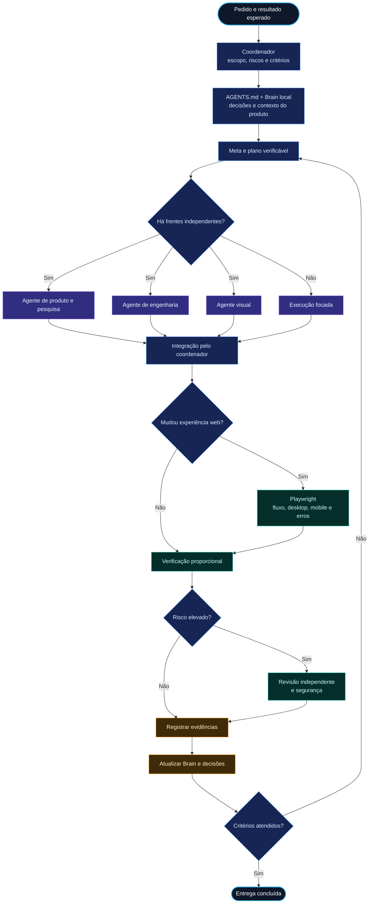

# HeBe Orchestrator for Codex

Versão 0.6.0: orquestração por escopo com `AGENTS.md` portátil, modelos disponíveis, memória local por projeto, Playwright e TypeSafe/Jev. O Brain do subprojeto é consultado primeiro; pais e cérebro central são referências adicionais usadas conforme a necessidade.

HeBeBrain é a opção principal de organização. Quem já usa Obsidian pode reaproveitá-lo; ambos podem abrir a mesma base Markdown. A [skill hebe-brain](https://github.com/HericlisBezerra/hebe-brain) e o visualizador são componentes separados: este plugin inclui o núcleo de memória e a orquestração.

## Mapa vertical da entrega



## Mapa e primeira configuração

O [mapa do projeto](docs/MAPA-DO-PROJETO.md) mostra a configuração inicial e o ciclo de entrega em dois fluxogramas. O [onboarding](skills/orchestrate-models/references/onboarding.md) define quando perguntar e como retomar escolhas anteriores.

| Momento | Escolha ou ação |
|---|---|
| Primeiro uso da skill, antes de montar o Brain | Detectar `hebe-brain` no host atual; se ausente, sugerir instalação com fonte verificada |
| Antes de criar a central | Recomendar HeBeBrain; oferecer Obsidian existente ou ambos sobre a mesma base |
| Após definir a raiz local | Oferecer GitHub; aproveitar conexão existente e preparar destino autorizado |
| Opções de consulta | Oferecer TypeSafe/Jev e reaproveitar a credencial quando já configurada |
| Conectar Jev | Abrir `python3 scripts/jev.py configure --web`; o usuário insere a chave na página local e a autenticação é verificada antes de salvar |
| Antes da entrega composta | Propor escopo e meta com critérios de conclusão |

Este fluxo é conduzido pelo agente quando a skill é carregada na conversa. Instalar o plugin não inicia um assistente sozinho. As escolhas podem ficar em `SETUP.md` na central autorizada; o agente lê esse documento, e o CLI `brain.py` continua exigindo `--home` explícito.

## Estado desta versão

| Recurso | Implementação |
|---|---|
| Mapa e primeira configuração | Fluxogramas e perguntas sequenciais conduzidas pela skill |
| Contrato multiagente | `AGENTS.md`, bridge `CLAUDE.md`, template e inicializador por projeto |
| Registro de projetos e subprojetos | CLI local, UUID estável e pai explícito |
| Brain, vault e decisões | Adoção de arquivos existentes; atualização de seções gerenciadas |
| Eventos e proveniência | SQLite, idempotência, escritor serializado e reconsolidação |
| Contexto e busca | Resolução da pasta mais específica; busca textual nos eventos |
| Histórico Git | Coletor local por caminho, com hash e distinção entre commit e publicação |
| GitHub | Onboarding orientado pela skill: disponibilidade, autenticação, acesso e destino autorizado |
| Metas | Orientação para os mecanismos nativos Codex/Claude, com critérios de conclusão |
| Modelos | Perfis de tarefa e consulta das capacidades expostas pelo host |
| TypeSafe/Jev | Configuração local, consulta de modelos e avaliação explícita via CLI |
| Playwright | Detecção, orientação e kit opcional desktop/mobile; testes são adaptados no produto alvo |
| Captura contínua, sync GitHub, recuperação automática com Jev e runner Claude | Etapas seguintes; não ativados por esta versão |

O núcleo usa Python 3.10+ e biblioteca padrão em macOS/Linux. Git é necessário somente para importar commits. Node é necessário apenas no projeto que adotar o kit Playwright. Obsidian é opcional. O catálogo de modelos, a continuidade de metas e os limites de agentes pertencem ao host.

## Usar a skill

Após o plugin ser instalado e carregado no Codex, peça:

> Use $orchestrate-models para mostrar o mapa e configurar HeBeBrain, reaproveitar Obsidian se eu quiser, GitHub e a opção Jev.

Para uma entrega:

> Use $orchestrate-models para organizar este produto e seus subprojetos, preservar os Brains existentes e propor uma meta com critérios de conclusão.

## AGENTS.md para Codex, Claude Code e Grok

O contrato compartilhado fica em `AGENTS.md`. Codex e Grok o carregam pela hierarquia do repositório; Claude Code atual também oferece leitura direta. O `CLAUDE.md` incluído importa `@AGENTS.md` para projetos que já usam instruções Claude ou precisam de compatibilidade adicional.

```sh
python3 scripts/project_context.py status --path /caminho/projeto
python3 scripts/project_context.py init --path /caminho/projeto
```

`init` cria o contrato e o bridge Claude somente quando os arquivos não existem. Se encontrar instruções anteriores, preserva e informa a pendência para revisão. Regras de subprojeto podem viver em outro `AGENTS.md` mais próximo.

Referências: [OpenAI sobre AGENTS.md](https://developers.openai.com/blog/rethinking-skills-and-prompts-for-gpt-6-astra), [Claude Code sobre AGENTS.md](https://code.claude.com/docs/en/memory#agents-md) e [Grok CLI sobre AGENTS.md](https://github.com/xai-org/grok-build/blob/main/crates/codegen/xai-grok-shell/README.md#agentsmd).

## Playwright para evidência web

Em projetos Node sem configuração existente:

```sh
python3 scripts/project_context.py web-init --path /caminho/projeto
```

O comando cria `playwright.config.ts` e `tests/e2e/smoke.spec.ts`, sem instalar dependências nem iniciar servidores. O agente adapta o teste às rotas e critérios reais do produto e usa o gerenciador já adotado para instalar `@playwright/test`. O kit cobre Chromium desktop/mobile e retém trace, screenshot e vídeo quando há falha. Veja [a política de validação](skills/orchestrate-models/references/playwright.md).

Ao conduzir o onboarding, o agente verifica se o GitHub já está disponível e autenticado. Quando faltar, sugere a integração adequada; o trabalho local pode continuar. Criar repositório e enviar conteúdo dependem do destino e da autorização correspondente. Sincronização contínua ainda exige implementação.

Uma meta nativa exige pedido ou aceitação explícita. No Codex e Claude Code compatíveis, o usuário pode usar `/goal <resultado verificável>`. As instruções detalhadas e as diferenças entre os hosts estão em [delivery-goals.md](skills/orchestrate-models/references/delivery-goals.md). Uma pausa ou limite de uso não transforma uma entrega incompleta em concluída.

## Conectar TypeSafe/Jev

Crie sua chave no [console TypeSafe](https://console.typesafe.ai/). Na pasta do plugin, rode:

```sh
python3 scripts/jev.py configure --web
```

Abra o endereço local mostrado pelo comando, cole a chave no campo **Chave da API TypeSafe** e clique em **Conectar**. A conexão é confirmada pela consulta autenticada ao catálogo de modelos. Nenhuma nota do Brain é enviada nessa configuração.

A chave fica em `~/.config/hebe-brain/typesafe.json`, fora do projeto, com acesso restrito ao usuário. Para uma configuração somente pelo terminal, use `python3 scripts/jev.py configure` e digite a chave no prompt oculto. Quem já gerencia segredos pode fornecer `TYPESAFE_API_KEY` ao processo; a variável tem precedência sobre o arquivo local. Não colocar a chave em argumentos, chat, notas ou Git.

```sh
python3 scripts/jev.py status
python3 scripts/jev.py models
python3 scripts/jev.py evaluate --file /caminho/consulta-autorizada.json
```

`status` descreve a configuração local; `models` consulta o serviço; `evaluate` envia explicitamente o `state` e as `questions` daquele arquivo. A configuração da chave não habilita envio contínuo dos Brains. Ver [TypeSafe e Jev](skills/orchestrate-models/references/typesafe-jev.md) para preparar perguntas, selecionar contexto e tratar incerteza.

A [skill oficial TypeSafe](https://github.com/typesafe-ai/skills) pode ser instalada no projeto com `npx skills add typesafe-ai/skills --skill typesafe-ai`, selecionando Codex. Ela orienta o desenvolvimento; a credencial é configurada separadamente pelo conector acima.

## Núcleo local

Escolha uma raiz central e use a mesma configuração no Codex e Claude. O exemplo abaixo usa a pasta sugerida; não é uma pasta inicializada automaticamente pelo plugin.

```sh
HEBE_BRAIN_HOME="$HOME/.codex/hebe-brain"
python3 scripts/brain.py --home "$HEBE_BRAIN_HOME" status
python3 scripts/brain.py --home "$HEBE_BRAIN_HOME" init
python3 scripts/brain.py --home "$HEBE_BRAIN_HOME" register --path /caminho/produto --name Produto
python3 scripts/brain.py --home "$HEBE_BRAIN_HOME" register --path /caminho/produto/frontend --name Frontend --parent 'UUID-DO-PRODUTO'
python3 scripts/brain.py --home "$HEBE_BRAIN_HOME" context --path /caminho/produto/frontend/src
```

Use os UUIDs retornados pelo registro. A pasta mais profunda registrada define o contexto local. `--parent` estabelece uma relação lógica e não carrega automaticamente o conteúdo do pai ou de projetos irmãos. Worktrees podem usar `context --project 'UUID-EXISTENTE'`; detecção automática de worktrees ainda não está implementada.

O formato de eventos está em [brain-and-github.md](skills/orchestrate-models/references/brain-and-github.md). `record` grava eventos; `consolidate` atualiza as notas. Repetir um evento idêntico não duplica dados; reutilizar seu ID com conteúdo diferente é recusado.

```sh
python3 scripts/brain.py --home "$HEBE_BRAIN_HOME" record --file /caminho/eventos.json
python3 scripts/brain.py --home "$HEBE_BRAIN_HOME" consolidate --project 'UUID-DO-PROJETO'
python3 scripts/brain.py --home "$HEBE_BRAIN_HOME" search autenticação --project 'UUID-DO-PROJETO'
```

`decision.proposed` não entra no registro de decisões aceitas. `decision.superseded` precisa referenciar uma decisão aceita do mesmo projeto. As notas incluem data e fonte. Os arquivos humanos são preservados fora dos blocos `hebe-brain` gerenciados.

## Importar commits locais

O coletor só lê Git, filtra pelo caminho selecionado e emite eventos. Não faz fetch ou push. Confira o UUID e use a raiz exata do projeto/subprojeto; o coletor não consegue validar essa associação sem consultar o registro.

```sh
python3 scripts/git_events.py --path /caminho/produto/frontend --project 'UUID-DO-FRONTEND' --limit 50 > /tmp/hebe-commits.json
python3 scripts/brain.py --home "$HEBE_BRAIN_HOME" record --file /tmp/hebe-commits.json
python3 scripts/brain.py --home "$HEBE_BRAIN_HOME" consolidate --project 'UUID-DO-FRONTEND'
```

O limite seleciona os commits mais recentes que tocam o caminho. Para históricos maiores, use lotes planejados; o coletor atual não oferece paginação nem checkpoint Git automático. Renomes para fora da pasta não são seguidos automaticamente. Um SHA local não comprova publicação remota.

## Armazenamento e limites

O registro e os eventos ficam em `<raiz-central>/.state/brain.sqlite3`; essa pasta deve ficar fora de publicação Git por padrão. Markdown é a visualização do conhecimento; sozinho não restaura IDs, fila e checkpoints. Uma política de backup completo precisa tratar o banco explicitamente.

A busca atual cobre título e corpo dos eventos, sem indexar toda a prosa legada. A consolidação precisa ser chamada explicitamente e reavalia o histórico do projeto. Não há daemon, hooks ou chamadas externas ocultas; o conector Jev faz chamadas quando solicitado. Padrões evidentes de credenciais são recusados, mas o filtro não substitui revisão do material antes de publicação.

## Validação

```sh
python3 -m unittest discover -s tests -v
```

Os testes usam diretórios e repositórios temporários. Cobrem isolamento entre projetos, preservação de notas, replay, concorrência, recuperação, caminhos, eventos e importação Git.

A [arquitetura de evolução](docs/ORCHESTRATOR-EVOLUCAO.md) descreve as etapas seguintes e diferencia capacidades implementadas de integrações propostas.
