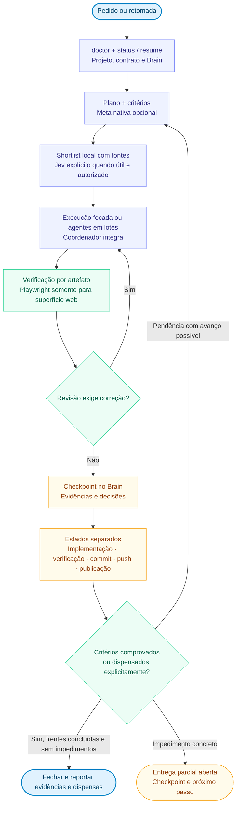

# HeBe Orchestrator for Codex

**Versão 0.7.0.** Coordenação de entregas com retomada por projeto, critérios verificáveis, agentes em lotes e checkpoints no HeBeBrain. `AGENTS.md` compartilha o contrato entre Codex, Claude Code e Grok; cada host conserva seus modelos, ferramentas e limites.

HeBeBrain é a opção principal de organização. Obsidian existente pode abrir a mesma base Markdown. A [skill hebe-brain](https://github.com/HericlisBezerra/hebe-brain) e o visualizador são componentes separados; este plugin inclui o núcleo de memória, a rotina local e a skill de coordenação.

## Começar ou retomar

Com o plugin carregado, peça:

> Use $orchestrate-models para conferir o projeto, retomar a entrega aberta e avançar no próximo critério pendente.

Para a primeira configuração completa:

> Use $orchestrate-models para mostrar o mapa e configurar HeBeBrain, GitHub e a opção Jev, reaproveitando minhas escolhas existentes.

A entrada rápida resolve apenas o que falta para o trabalho atual. GitHub, Jev, Obsidian e meta nativa são opcionais. Instalar o plugin não abre um assistente nem inicia captura ou execução contínua.

## Mapa vertical



O [mapa completo](docs/MAPA-DO-PROJETO.md) detalha contexto, confiança do Jev, lotes, revisão e estados de publicação. O [onboarding](skills/orchestrate-models/references/onboarding.md) distingue entrada rápida e configuração completa.

## Estado da versão

| Recurso | Estado na 0.7.0 |
|---|---|
| Rotina local | `orchestrator.py`: `configure`, `doctor`, `start`, `status`, `resume`, `update`, `checkpoint` e `close` |
| Retomada | Configuração persistente e uma entrega ativa por projeto, com objetivo, critérios, frentes, impedimentos e próximo passo |
| Diagnóstico do contrato | Presença e aplicabilidade observáveis; `host_loaded: unknown` sem introspecção do host |
| Brain e proveniência | UUIDs, relações explícitas, eventos SQLite, consolidação Markdown, origem Grok e estados distintos de commit, push e publicação |
| Decisões | Proposta separada de aceite; substituição relaciona decisão antiga e nova aceita por `supersedes` e `replacement` |
| Git | Coleta explícita de commits locais por caminho; não faz fetch ou push |
| GitHub | Onboarding e operações manuais usando ferramentas disponíveis, com destino e autorização definidos |
| Agentes e metas | Coordenação pela skill sobre os recursos efetivos do host; meta nativa opcional |
| TypeSafe/Jev | Configuração local, catálogo e avaliações explícitas; o agente prepara candidatos e avalia o resultado |
| Playwright | Detecção, orientação e kit opcional; adaptação e verificação no produto web são necessárias |
| Recursos futuros | Hooks, worker permanente, sync GitHub, backup/restauração completos, recuperação automática com Jev e runner Claude |

Python 3.10+ e biblioteca padrão em macOS/Linux. Git é necessário para importar commits; Node e Chromium são necessários no projeto que adotar o kit Playwright. O catálogo de modelos, os slots e a continuidade de execução pertencem ao host.

## Runtime da rotina

Resolver a raiz da instalação ativa. Nos exemplos abaixo, substitua a pasta ilustrativa:

```sh
HEBE_PLUGIN_ROOT="/caminho/instalacao/hebe-orchestrator-codex"
python3 "$HEBE_PLUGIN_ROOT/scripts/orchestrator.py" configure --brain-home /caminho/central
python3 "$HEBE_PLUGIN_ROOT/scripts/orchestrator.py" doctor --path /caminho/projeto
python3 "$HEBE_PLUGIN_ROOT/scripts/orchestrator.py" status --path /caminho/projeto
python3 "$HEBE_PLUGIN_ROOT/scripts/orchestrator.py" resume --path /caminho/projeto
```

A central segue a precedência `--home`, `HEBE_BRAIN_HOME` e configuração persistida. `configure` guarda a escolha; consultar o diagnóstico antes de inicializar ou registrar projetos. `start` seleciona um projeto por UUID ou caminho registrado. `resume` prepara contexto, sem iniciar agentes ou retomar uma meta nativa automaticamente. `checkpoint` e `close` aceitam a origem e referência observadas com `--source` e `--source-ref`. O [contrato do runtime](skills/orchestrate-models/references/daily-runtime.md) descreve os comandos.

`close` exige critérios `passed` ou `waived` com evidência, frentes concluídas e ausência de impedimentos. `waived` registra dispensa explícita com justificativa; não significa teste aprovado. Uma entrega parcial permanece aberta com próximo passo. Commit, push e publicação têm evidências próprias e só são realizados quando pertencem ao escopo autorizado.

## Contrato portátil e verificação

`AGENTS.md` é a fonte compartilhada; `CLAUDE.md` importa `@AGENTS.md` para compatibilidade. Carregamento depende da versão e configuração de cada host. Usar `doctor` e, quando disponível, introspecção do host; um arquivo presente não comprova que entrou no contexto. Ver [agent-contract.md](skills/orchestrate-models/references/agent-contract.md).

```sh
python3 "$HEBE_PLUGIN_ROOT/scripts/project_context.py" status --path /caminho/projeto
python3 "$HEBE_PLUGIN_ROOT/scripts/project_context.py" init --path /caminho/projeto
```

O inicializador preserva arquivos existentes. O agente preenche objetivo, comandos e critérios com dados reais. Verificar cada artefato com o método adequado: código/API, documento renderizado, dados reconciliados, mídia exportada ou experiência web.

**Playwright aplica-se à superfície web.** Reutilizar a configuração existente; quando faltar e a validação no navegador for material:

```sh
python3 "$HEBE_PLUGIN_ROOT/scripts/project_context.py" web-init --path /caminho/projeto-web
```

O kit não instala dependências nem inicia o servidor por conta própria. Adaptar rotas, conteúdo esperado e critérios antes de executá-lo. A [política Playwright](skills/orchestrate-models/references/playwright.md) inclui jornada real, estado relevante de falha, desktop/mobile, erros e inspeção visual. Um smoke genérico não comprova o funcionamento do produto.

## TypeSafe/Jev explícito

Crie a chave no [console TypeSafe](https://console.typesafe.ai/) e conecte pelo formulário local:

```sh
python3 "$HEBE_PLUGIN_ROOT/scripts/jev.py" status
python3 "$HEBE_PLUGIN_ROOT/scripts/jev.py" configure --web
python3 "$HEBE_PLUGIN_ROOT/scripts/jev.py" models
python3 "$HEBE_PLUGIN_ROOT/scripts/jev.py" preview --file /caminho/consulta-autorizada.json
python3 "$HEBE_PLUGIN_ROOT/scripts/jev.py" evaluate --file /caminho/consulta-autorizada.json
```

Reutilizar credencial configurada antes de abrir o formulário. A configuração consulta o catálogo e não envia notas do Brain. A chave fica fora do projeto, em `~/.config/hebe-brain/typesafe.json`, com acesso restrito ao usuário; `TYPESAFE_API_KEY` tem precedência. `configure` sem `--web` usa prompt oculto no terminal. Nunca colocar a chave no chat, argumentos, Brain ou Git.

`preview` valida e resume o pedido localmente, sem credencial ou rede. `evaluate` envia o `state` e as `questions` explicitamente selecionados. A shortlist vem da busca local; o agente pode usar os julgamentos para rerank e tratar confiança/abstenção conforme [typesafe-jev.md](skills/orchestrate-models/references/typesafe-jev.md). Reranking automático e conexão contínua ao Brain permanecem futuros. A [skill oficial TypeSafe](https://github.com/typesafe-ai/skills) orienta o uso, mas não autentica a API.

## Núcleo local e Git

Os CLIs especializados continuam disponíveis. `brain.py` exige `--home` explícito; a configuração do orquestrador não modifica a interface desse comando.

```sh
HEBE_BRAIN_HOME="/caminho/central"
python3 "$HEBE_PLUGIN_ROOT/scripts/brain.py" --home "$HEBE_BRAIN_HOME" status
python3 "$HEBE_PLUGIN_ROOT/scripts/brain.py" --home "$HEBE_BRAIN_HOME" init
python3 "$HEBE_PLUGIN_ROOT/scripts/brain.py" --home "$HEBE_BRAIN_HOME" register --path /caminho/produto --name Produto
python3 "$HEBE_PLUGIN_ROOT/scripts/brain.py" --home "$HEBE_BRAIN_HOME" context --path /caminho/produto
```

Usar os UUIDs devolvidos. Registrar subprojetos reais com `--parent UUID-DO-PAI`; a relação não carrega automaticamente o conteúdo dos pais ou irmãos. Worktrees podem consultar identidade existente com `context --project UUID`; resolução automática de aliases ainda é futura.

`record` guarda eventos; `consolidate` aplica as notas. `checkpoint` faz a integração do estado da entrega com o Brain. Repetir um evento idêntico não duplica dados; conteúdo diferente com o mesmo ID é recusado. As seções humanas fora dos blocos gerenciados são preservadas. Ver [Brain, eventos e GitHub](skills/orchestrate-models/references/brain-and-github.md).

```sh
python3 "$HEBE_PLUGIN_ROOT/scripts/git_events.py" --path /caminho/produto --project UUID-DO-PROJETO --limit 50 > /tmp/hebe-commits.json
python3 "$HEBE_PLUGIN_ROOT/scripts/brain.py" --home "$HEBE_BRAIN_HOME" record --file /tmp/hebe-commits.json
python3 "$HEBE_PLUGIN_ROOT/scripts/brain.py" --home "$HEBE_BRAIN_HOME" consolidate --project UUID-DO-PROJETO
```

Conferir a associação entre UUID e caminho antes da coleta. O limite seleciona os commits recentes que tocam aquele caminho; `--before-revision SHA-COMPLETO` continua do último commit do lote anterior. Checkpoint Git automático e acompanhamento de renomes para fora da pasta ainda não estão implementados. Commit local não comprova push ou publicação.

## Armazenamento e limites

O registro e os eventos ficam em `<raiz-central>/.state/brain.sqlite3`; entregas e checkpoints usam `.state/orchestrator.sqlite3`. Ambos ficam fora do envio Git padrão. Markdown permite consultar o conhecimento, mas não restaura sozinho IDs, fila e checkpoints. Um snapshot da entrega não é um backup restaurável de toda a base. **Sync GitHub e backup/restauração completos permanecem futuros.**

A busca do núcleo cobre título e corpo de eventos; prosa legada pode ser consultada diretamente pelo agente, sem alegar índice automático de todo o vault. Consolidar é uma operação explícita. O filtro de padrões de credenciais reduz erros evidentes e não substitui revisão do material selecionado para publicação.

## Validação e evolução

```sh
python3 -m unittest discover -s tests -v
```

Executar na raiz do plugin. Os testes usam recursos temporários; seu resultado deve acompanhar a revisão testada. Validar também o pacote instalado antes de distribuir: versão declarada, conteúdo do checkout e publicação são estados distintos.

A [arquitetura de evolução](docs/ORCHESTRATOR-EVOLUCAO.md) organiza as próximas etapas sem ativá-las. A versão 0.7.0 não instala hooks, scheduler, runner Claude ou sincronização permanente.
