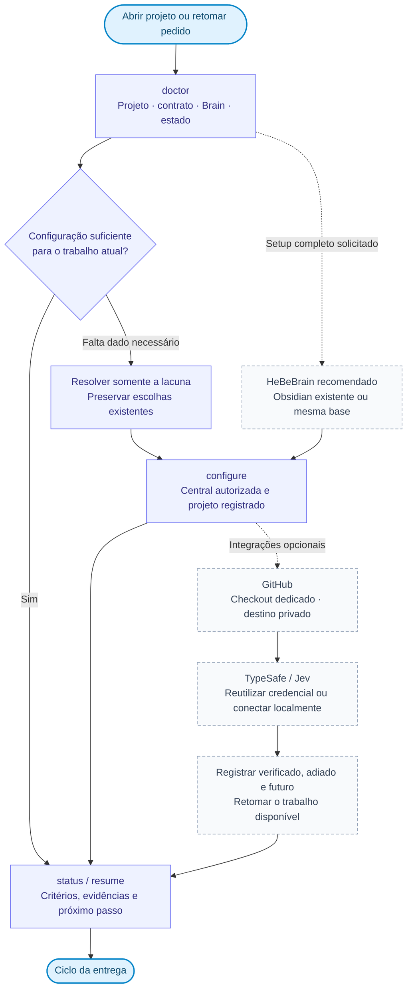

# Mapa do HeBe Orchestrator

Na versão **0.8.0**, a rotina localiza o projeto, retoma seu estado, observa as capacidades do host e organiza a execução dentro dos limites reais. `orchestrator.py` persiste a entrega; os CLIs especializados registram modelos, planejam ondas, reordenam shortlists e protegem o Brain. O fluxo orienta o coordenador e não representa um serviço ativado pela instalação.

## Entrada rápida ou configuração completa

A entrada rápida aproveita o que já existe. A configuração completa é usada quando o usuário pede setup ou revisão das integrações. Recomendar HeBeBrain; oferecer Obsidian existente ou ambos sobre a mesma base antes de criar uma central.

`doctor` distingue arquivo **presente**, contrato **aplicável** e carregamento observado. Sem introspecção do host, `host_loaded` é `unknown`. A fonte operacional é [daily-runtime.md](../skills/orchestrate-models/references/daily-runtime.md); a sequência de escolhas está no [onboarding](../skills/orchestrate-models/references/onboarding.md).

## Ciclo vertical de entrega

O plano local contém objetivo e critérios. A meta nativa é opcional. O contexto nasce no projeto/subprojeto; pais e central entram conforme a necessidade, sem misturar automaticamente outros projetos.

```mermaid
flowchart TB
    A(["Pedido ou retomada"]) --> D["doctor + status / resume<br/>Projeto, contrato e trabalho aberto"]
    D --> MR["Registrar catálogo observado<br/>import ou import-codex"]
    MR --> MU{"Modelo novo ou<br/>upgrade anunciado?"}
    MU -->|Sim| MC["Criar candidato de avaliação<br/>Sem promoção silenciosa"]
    MU -->|Não| P
    MC --> P["Plano + critérios observáveis<br/>start / update · meta nativa opcional"]

    P --> L["Shortlist local<br/>Projeto → pais necessários → central"]
    L --> J{"Jev é útil e o envio<br/>foi autorizado?"}
    J -->|Sim| JV["jev_rerank evaluate --send<br/>Noul por candidato"]
    JV --> JA{"Maior probabilidade<br/>atinge o limiar?"}
    JA -->|Sim| JR["Ordem Jev validada<br/>IDs e fontes preservados"]
    JA -->|Não| LF["Abstenção<br/>Conservar ordem local"]
    J -->|Não| LF
    JR --> CT["Contexto selecionado<br/>pelo coordenador"]
    LF --> CT

    CT --> M{"Há frentes independentes<br/>além dos slots?"}
    M -->|Sim| DAG["DAG declarativa<br/>Tarefas · dependências · modelos"]
    DAG --> BW["batch_scheduler<br/>Ondas dentro dos slots observados"]
    BW --> EX["Host executa uma onda<br/>O scheduler não lança agentes"]
    M -->|Não| EX2["Execução focada<br/>Agente principal ou script"]
    EX --> I["Coordenador integra<br/>Observa resultado e replana"]
    EX2 --> I
    I --> MORE{"Restam ondas<br/>desbloqueadas?"}
    MORE -->|Sim| BW
    MORE -->|Não| V

    V["Verificar o artefato alterado<br/>Código/API · documento · dados · mídia"] --> W{"Superfície web afetada?"}
    W -->|Sim| PW["Playwright + inspeção visual<br/>Jornada · falha · desktop/mobile"]
    W -->|Não| RK
    PW --> RK{"Revisão independente<br/>necessária pelo risco?"}
    RK -->|Sim| RV["Revisão proporcional<br/>Fontes, diff e cobertura"]
    RV --> RF{"Há achado material?"}
    RF -->|Sim| FIX["Corrigir implementação<br/>Rever evidências afetadas"]
    FIX --> I
    RK -->|Não| OK["Registrar evidências por critério"]
    RF -->|Não| OK

    OK --> CP["checkpoint no Brain<br/>Decisões, critérios e próximo passo"]
    CP --> SE{"Backup Git configurado<br/>e dentro do escopo?"}
    SE -->|Sim| SX["export snapshot<br/>Conteúdo + estado canônico"]
    SX --> SV["verify<br/>Manifesto, hashes e estrutura"]
    SV --> SC["commit local no checkout dedicado"]
    SC --> SP["push sem force<br/>Destino e revisão observados"]
    SP --> U
    SE -->|Não| U["update + checkpoint<br/>Estados e evidências separados"]
    U --> G{"Critérios comprovados ou dispensados?<br/>Frentes concluídas e sem impedimentos?"}
    G -->|Sim| Z(["close · conclusão reportada"])
    G -->|Não, há avanço| P
    G -->|Impedimento| H(["Entrega parcial aberta<br/>Checkpoint + próximo passo"])

    classDef entry fill:#e0f2fe,color:#0c4a6e,stroke:#0284c7,stroke-width:2px;
    classDef control fill:#eef2ff,color:#312e81,stroke:#6366f1;
    classDef context fill:#f0f9ff,color:#075985,stroke:#38bdf8;
    classDef execute fill:#f5f3ff,color:#5b21b6,stroke:#a78bfa;
    classDef verify fill:#ecfdf5,color:#065f46,stroke:#34d399;
    classDef memory fill:#fffbeb,color:#92400e,stroke:#f59e0b;
    classDef partial fill:#fff7ed,color:#9a3412,stroke:#fb923c,stroke-width:2px;
    class A,Z entry;
    class D,MR,MU,MC,P,J,JA,M,MORE,W,RK,RF,SE,G control;
    class L,JV,JR,LF,CT context;
    class DAG,BW,EX,EX2,I,FIX execute;
    class V,PW,RV,OK,SV verify;
    class CP,SX,SC,SP,U memory;
    class H partial;
```

## Como ler o mapa

**Modelos:** o registro conserva snapshots observados por fonte. `import-codex` normaliza uma resposta `model/list` já obtida do App Server; não consulta o provedor. IDs novos, diferenças e `upgradeInfo` produzem candidatos de avaliação. A política pode ordenar candidatos elegíveis, mas mudança de preferência exige evidência ou uma política explícita do usuário.

**Ondas:** `batch_scheduler.py` valida DAG, ciclos, dependências e limites globais/por modelo. Sua saída é um plano determinístico. Ele não cria agentes nem contorna os slots do host. Depois de cada onda executada pelas ferramentas nativas, o coordenador observa estados e replana.

**Jev:** a shortlist nasce localmente. `preview` não usa rede; `evaluate --send` autoriza aquela chamada. O primeiro item só é promovido quando a resposta tipada passa pelo limiar. Credencial ausente, serviço indisponível ou probabilidade insuficiente causam abstenção e preservam a ordem local. Jev não concede autorização nem comprova o trabalho.

**Git e recuperação:** exportar, verificar, commitar, enviar e restaurar são estados separados. O checkout de backup precisa existir, ser dedicado e apontar ao destino esperado. Para remoto, a privacidade é confirmada pelo operador; o CLI não a verifica. `restore` planeja primeiro e só aplica com `--apply`, sem sobrescrever arquivo divergente. O sync pessoal não é ativado pela instalação nem por `configure`.

## Capacidades e fronteiras

A [tabela de estado no README](../README.md#estado-da-versão) é a referência da versão. Os comandos precisam ser chamados pelo agente ou por um runner explicitamente ativado. `resume` prepara contexto; `checkpoint` registra o estado; `batch_scheduler.py` apenas planeja.

Hooks e captura global, recovery automático orientado por Jev, runner Claude e adaptação a protocolos novos permanecem **futuros**. O sync Git e a restauração estão implementados, mas dependem da configuração e ativação explícitas descritas em [brain-and-github.md](../skills/orchestrate-models/references/brain-and-github.md).

Referências: [contratos](../skills/orchestrate-models/references/agent-contract.md), [metas](../skills/orchestrate-models/references/delivery-goals.md), [roteamento](../skills/orchestrate-models/references/model-routing.md), [Brain e GitHub](../skills/orchestrate-models/references/brain-and-github.md), [Playwright](../skills/orchestrate-models/references/playwright.md), [TypeSafe/Jev](../skills/orchestrate-models/references/typesafe-jev.md) e [evolução](ORCHESTRATOR-EVOLUCAO.md).
