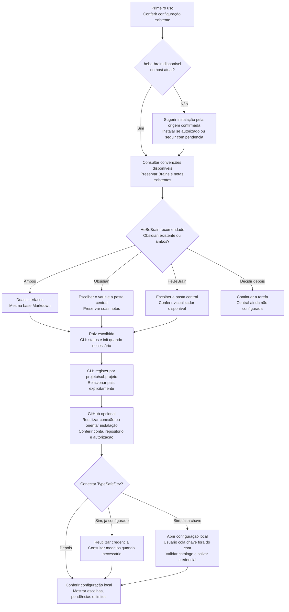
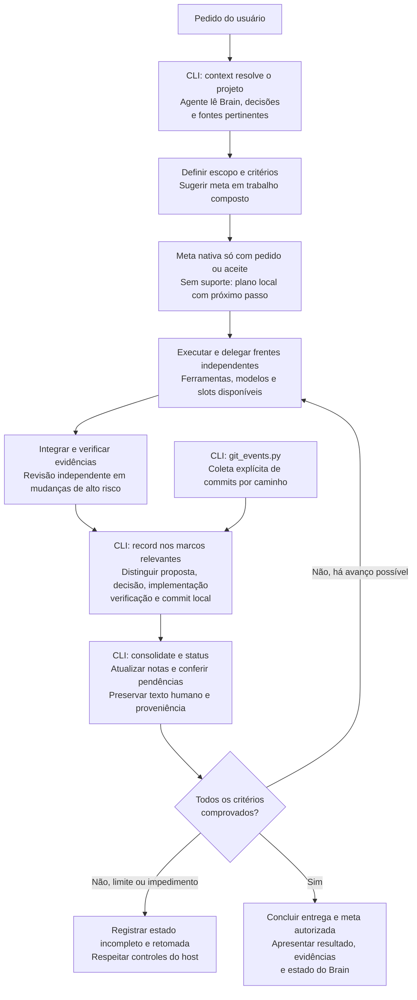

# Mapa do HeBe Orchestrator

Na versão **0.5.0**, a skill conduz a conversa e a coordenação; os comandos locais registram projetos, eventos, notas e commits. O conector TypeSafe/Jev oferece configuração e chamadas explícitas. Instalar o plugin não inicia captura contínua nem conecta serviços.

## Primeira configuração

O [onboarding](../skills/orchestrate-models/references/onboarding.md) começa no primeiro uso e reutiliza escolhas já feitas. Recomendar HeBeBrain e escolher entre ele, Obsidian existente ou ambos vem **antes de definir ou criar a raiz central**.

A instalação da skill `hebe-brain`, quando ausente, é uma etapa orientada pelo agente e pelos recursos do host. A fonte é [HericlisBezerra/hebe-brain](https://github.com/HericlisBezerra/hebe-brain), pasta `hebe-brain/`. Verificar o acesso ao repositório e a revisão antes de instalar. A leitura de Markdown e o núcleo local podem avançar enquanto a instalação estiver pendente.

GitHub já conectado **não precisa ser reinstalado**. Instalação, autenticação, acesso ao repositório e envio são estados distintos. Após escolher a raiz, o usuário pode adotar um destino privado para backup; criação e push seguem a autorização existente para aquele destino. O sync automático ainda não existe.

Ao escolher Jev, usar `python3 scripts/jev.py status`. Se faltar credencial, abrir `python3 scripts/jev.py configure --web`: o usuário insere a chave no formulário local, e o conector consulta o catálogo TypeSafe antes de salvar. `TYPESAFE_API_KEY` também é aceito. A chave fica fora do Brain, dos prompts e do Git. A configuração consulta modelos; as avaliações enviam apenas o conteúdo explicitamente selecionado. Recuperação automática e captura contínua ainda são etapas futuras.

## Ciclo de entrega e memória

O Brain do subprojeto vem primeiro. Consultar o pai e a central conforme a necessidade; `--parent` não incorpora automaticamente registros de irmãos ou o conteúdo do pai.

Em alto risco, o agente pode encaminhar a revisão à skill `hebe-security-scan` disponível, seguindo seu escopo e instruções. A execução não é disparada apenas por este mapa. Uma pausa, cota ou falha de acesso mantém critérios pendentes; não comprova conclusão.

## O que executa hoje e o que falta

| Camada | Estado nesta versão |
|---|---|
| CLI local | `init`, `register`, `context`, `record`, `consolidate`, `status`, `list`, `search` e coleta explícita com `git_events.py` |
| Instruções conversacionais | Onboarding, consulta ao Brain, escolha de modelos disponíveis, delegação, sugestão de metas e revisão proporcional |
| TypeSafe/Jev | `configure`, `status`, `models` e `evaluate --file`; chamadas explícitas, sem varrer ou enviar Brains automaticamente |
| Recursos do host | Agentes, modelos, permissões e continuidade de metas dependem do Codex ou Claude instalado |
| Etapas futuras | Hooks de captura, worker permanente, sync automático GitHub, recuperação automática com Jev e runner Claude; **não ativos nesta versão** |

`record` guarda eventos; `consolidate` aplica as notas. Os comandos precisam ser chamados durante o trabalho. Um commit local não comprova push. Markdown permite consultar o conhecimento, mas a recuperação de IDs, fila e checkpoints também depende do armazenamento SQLite central.

Referências: [README](../README.md), [Brain e GitHub](../skills/orchestrate-models/references/brain-and-github.md), [metas de entrega](../skills/orchestrate-models/references/delivery-goals.md), [roteamento e provedores](../skills/orchestrate-models/references/model-routing.md) e [arquitetura de evolução](ORCHESTRATOR-EVOLUCAO.md).
