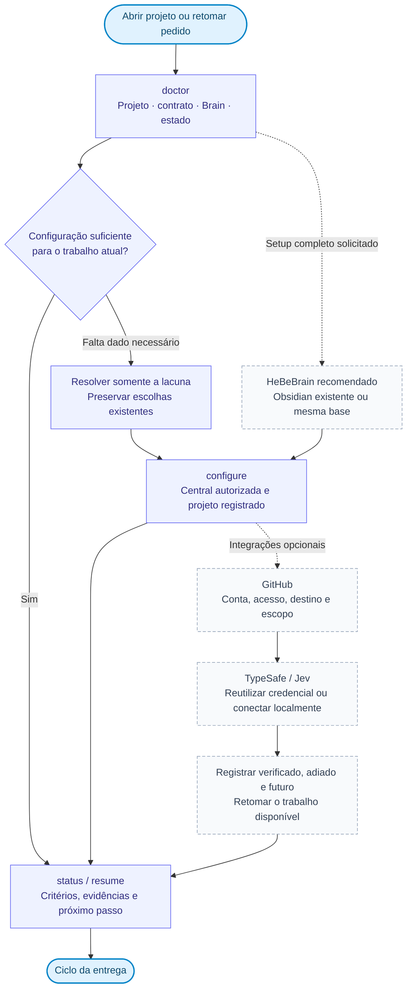

# Mapa do HeBe Orchestrator

Na versão **0.7.0**, a rotina começa por localizar o projeto e retomar seu estado. `scripts/orchestrator.py` persiste configuração, critérios, frentes e checkpoints; a skill coordena execução e verificação com as ferramentas do host. O fluxo abaixo orienta o agente: não representa um scheduler ou serviços ativados pela instalação.

## Entrada rápida ou configuração completa

A entrada rápida aproveita o que já existe. A configuração completa é usada quando o usuário pede setup ou revisão das integrações. Recomendar HeBeBrain; oferecer Obsidian existente ou ambos sobre a mesma base antes de criar uma central. Escolhas opcionais podem ficar adiadas.

`doctor` distingue arquivo **presente**, contrato **aplicável** e carregamento observado. Sem introspecção do host, `host_loaded` é `unknown`. Um contrato no disco não comprova que o Codex, Claude Code ou Grok o carregou. A fonte de detalhe operacional é [daily-runtime.md](../skills/orchestrate-models/references/daily-runtime.md); a sequência de escolhas está no [onboarding](../skills/orchestrate-models/references/onboarding.md).

## Ciclo vertical de entrega

O plano local contém objetivo e critérios. A meta nativa é opcional. O contexto nasce no projeto/subprojeto; pais e central entram conforme a necessidade, sem misturar automaticamente registros de outros projetos.

```mermaid
flowchart TB
    A(["Pedido ou retomada"]) --> D["doctor + status / resume<br/>Projeto, contrato e trabalho aberto"]
    D --> P["Plano + critérios observáveis<br/>start / update · meta nativa opcional"]

    subgraph CONTEXTO["1 · Contexto com fontes"]
        direction TB
        L["Shortlist local<br/>Projeto → pais necessários → central"] --> J{"Jev é útil<br/>e o envio está autorizado?"}
        J -->|Sim| JV["Avaliação explícita<br/>Rerank e confiança quando fornecida"]
        JV --> CF["Conferir fontes e incerteza<br/>Abster ou ampliar evidência se necessário"]
        J -->|Não| CF
        CF --> CT["Contexto selecionado pelo coordenador"]
    end
    P --> L

    subgraph EXECUCAO["2 · Execução e integração"]
        direction TB
        M{"Há frentes independentes?"} -->|Sim| B["Agentes em lotes<br/>Slots reais · arquivos exclusivos<br/>modelo e esforço observados"]
        M -->|Não| E["Execução focada<br/>Agente principal ou script"]
        B --> I["Coordenador integra<br/>Inspeciona evidências e conflitos"]
        E --> I
    end
    CT --> M

    subgraph VERIFICACAO["3 · Evidência por artefato"]
        direction TB
        V["Verificar o resultado alterado<br/>Código/API · documento · dados · mídia"] --> W{"Existe superfície web<br/>afetada pela entrega?"}
        W -->|Sim| PW["Playwright + inspeção visual<br/>Jornada · falha relevante · desktop/mobile"]
        W -->|Não| RK
        PW --> RK{"Revisão independente<br/>necessária pelo risco?"}
        RK -->|Sim| RV["Revisão proporcional<br/>Fontes, revisão Git e cobertura"]
        RV --> RF{"Há achado material?"}
        RF -->|Sim| FIX["Corrigir na implementação<br/>Rever evidências afetadas"]
        RK -->|Não| OK["Registrar evidências por critério"]
        RF -->|Não| OK
    end
    I --> V
    FIX --> I

    subgraph ESTADO["4 · Memória e estados da entrega"]
        direction TB
        CP["checkpoint no Brain<br/>Decisões, critérios e próximo passo"] --> LC["Commit local<br/>SHA observado ou não aplicável"]
        LC --> PS["Push<br/>Remoto + revisão confirmados<br/>ou não aplicável"]
        PS --> PB["Publicação<br/>Ambiente + resultado verificado<br/>ou não aplicável"]
        PB --> U["update + checkpoint<br/>Conservar cada estado e sua evidência"]
    end
    OK --> CP
    U --> G{"Critérios vigentes comprovados<br/>ou dispensados explicitamente?<br/>Frentes concluídas e sem impedimentos?"}
    G -->|Sim| Z(["close · conclusão reportada<br/>Comprovação e dispensas separadas"])
    G -->|Não, há avanço possível| P
    G -->|Impedimento concreto| H(["Entrega parcial permanece aberta<br/>Checkpoint + próximo passo para resume"])

    classDef entry fill:#e0f2fe,color:#0c4a6e,stroke:#0284c7,stroke-width:2px;
    classDef control fill:#eef2ff,color:#312e81,stroke:#6366f1;
    classDef context fill:#f0f9ff,color:#075985,stroke:#38bdf8;
    classDef execute fill:#f5f3ff,color:#5b21b6,stroke:#a78bfa;
    classDef verify fill:#ecfdf5,color:#065f46,stroke:#34d399;
    classDef memory fill:#fffbeb,color:#92400e,stroke:#f59e0b;
    classDef partial fill:#fff7ed,color:#9a3412,stroke:#fb923c,stroke-width:2px;
    class A,Z entry;
    class D,P,J,M,W,RK,RF,G control;
    class L,JV,CF,CT context;
    class B,E,I,FIX execute;
    class V,PW,RV,OK verify;
    class CP,LC,PS,PB,U memory;
    class H partial;
```

**Como ler os estados:** commit, push e publicação são independentes e só entram como ações quando pertencem ao escopo autorizado. O mapa pede registrar seu estado; não exige publicar toda entrega. Um SHA local não comprova push; push não comprova deploy. Critério obrigatório pendente mantém a entrega parcial. A dispensa exige evidência da autorização e motivo, e nunca vira verificação aprovada.

**Como ler o Jev:** a shortlist e a decisão do coordenador são parte do fluxo orientado pela skill. O conector executa chamadas explícitas. Reranking integrado e automático ainda é futuro. `Choice` e `Score` podem fornecer confiança; `Noul` fornece probabilidade. Nenhum desses sinais concede autorização ou comprova a correção do trabalho.

## Capacidades e fronteiras

A [tabela de estado no README](../README.md#estado-da-versão) é a referência das capacidades da versão. Os comandos precisam ser chamados pelo agente; `resume` prepara contexto e `checkpoint` registra/consolida o estado, sem manter execução após o fim da sessão.

Hooks de captura, worker permanente, sync GitHub, backup restaurável, recuperação automática com Jev e runner Claude permanecem **futuros**. Configurar GitHub ou salvar um snapshot da entrega não comprova backup recuperável. Markdown consulta o conhecimento; identidade, eventos e checkpoints também dependem do SQLite central.

Referências: [contratos](../skills/orchestrate-models/references/agent-contract.md), [metas](../skills/orchestrate-models/references/delivery-goals.md), [Brain e GitHub](../skills/orchestrate-models/references/brain-and-github.md), [Playwright](../skills/orchestrate-models/references/playwright.md), [TypeSafe/Jev](../skills/orchestrate-models/references/typesafe-jev.md) e [evolução](ORCHESTRATOR-EVOLUCAO.md).
