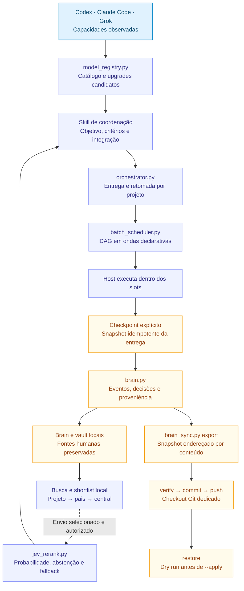

# HeBe Orchestrator: evolução a partir da rotina

Revisão de arquitetura: 2026-09-23. A versão **0.8.0** reúne entrega persistente, catálogo observado, planejamento de lotes, reranking Jev e recuperação por snapshots Git. O [README](../README.md#estado-da-versão) mantém o estado das capacidades; o [mapa vertical](MAPA-DO-PROJETO.md) mostra a sequência operacional.

O objetivo é concluir trabalho autorizado com evidência e conservar o contexto necessário à próxima sessão. O projeto/subprojeto é consultado primeiro. Agentes, modelos e serviços opcionais entram quando melhoram a entrega.

## Base da 0.8.0

| Componente | Responsabilidade implementada | Fronteira |
|---|---|---|
| `AGENTS.md` e bridge Claude | Contrato compartilhado e criação sem sobrescrever arquivos existentes | Presença no disco não comprova carregamento no host |
| `orchestrator.py` | Configurar central; diagnosticar; iniciar, consultar, atualizar, retomar, fazer checkpoint e fechar entrega | Não executa agentes, testes, push ou deploy |
| `brain.py` e `git_events.py` | Identidade, eventos, Markdown e observação de commits locais por caminho | Coleta Git não confirma push e prosa legada não é toda indexada |
| `model_registry.py` | Catálogo privado por fonte, importação genérica, adapter `model/list`, diferenças e recomendação por política | Não consulta provedor nem promove upgrade por conta própria |
| `batch_scheduler.py` | Validação de DAG e planejamento determinístico em ondas com slots globais/por modelo | Não lança agentes, processos ou tarefas |
| `jev.py` e `jev_rerank.py` | Credencial protegida, avaliação explícita, Noul por candidato, limiar, abstenção e fallback local | Não recuperam candidatos nem autorizam o envio de um vault |
| `brain_sync.py` | Snapshot determinístico, verificação, commit/push Git e restauração segura | Exige checkout dedicado; não cria repo, não guarda auth e não ativa runner implicitamente |
| `project_context.py` e templates | Inspecionar contratos/configurações e preparar kit web quando pertinente | Preparar um kit não verifica o produto |
| Skill de coordenação | Plano, ondas, integração, evidência e revisão proporcional | Executa dentro das ferramentas, permissões e limites reais da sessão |

`configure` persiste a central; não inicializa o Brain. O runtime mantém uma entrega ativa por projeto e snapshots idempotentes por revisão. `close` exige critérios comprovados ou dispensados explicitamente, frentes concluídas e ausência de impedimentos. Entrega parcial permanece aberta para retomada.

## Estado junto da fonte

Os projetos mantêm `Brain.md`, vault e decisões existentes. O registro central localiza esses projetos e suas relações, sem copiar automaticamente todos os documentos. Worktrees podem consultar o UUID existente; descoberta automática de aliases ainda é futura.

A configuração operacional fica em `~/.config/hebe-brain/`. A central mantém `.state/brain.sqlite3` e `.state/orchestrator.sqlite3`, fora do Git padrão. Markdown é legível e portátil. `brain_sync.py` exporta os documentos elegíveis e os dois bancos como JSON canônico, evitando copiar páginas SQLite ou executar SQL vindo do snapshot.

Proposta, aceite, implementação, verificação, commit, push e publicação são eventos distintos. `decision.superseded` liga a decisão antiga à nova aceita. O sync também separa exportação, verificação, commit, push e restauração. Um desses estados não comprova os seguintes.

## Catálogo e escala sem suposições

`model_registry.py import` aceita um snapshot observado. `import-codex` normaliza uma resposta `model/list` já obtida do Codex App Server e recebe `--max-parallel` observado na sessão. O catálogo mantém fonte e data. Alterações, modelos novos e upgrades anunciados ficam visíveis; são candidatos de avaliação, sem mudança silenciosa de preferência.

`recommend` filtra por capacidades e esforço e aplica uma política local opcional. O resultado é uma ordenação, não evidência de qualidade. Comparações representativas usam critérios iguais e observam correção, retrabalho, qualidade visual, latência e uso quando disponíveis.

`batch_scheduler.py` valida até a escala aceita pelo formato, rejeita ciclos e referências inválidas e produz ondas dentro de `global_slots` e `model_slots`. Dependências só liberam tarefas em ondas seguintes. A saída declara `planning_only; replan after each observed wave`: o coordenador usa as ferramentas nativas do host e registra o resultado antes de continuar.

## Evidência antes de automação

A unidade de qualidade é o critério da entrega. Código/API exige comportamento observado; documento, inspeção do render; dados, reconciliação; mídia, conferência do export; superfície web, jornada e inspeção visual com Playwright quando adequado. Achado material retorna à implementação e à verificação afetada.

Jev reordena uma shortlist pequena já recuperada localmente. `preview` valida sem rede. `evaluate --send` produz uma pergunta `Noul` independente por candidato, valida IDs e forma e só altera a ordem quando a maior probabilidade atinge o limiar. Em erro de credencial/serviço ou baixa probabilidade, a operação se abstém e conserva a ordem local. Permissões, cálculos, escrita e execução permanecem em código e ferramentas.

`brain_sync.py` exporta somente documentos elegíveis e estado conhecido, recusa padrões evidentes de segredo e produz manifesto com hashes. `verify` prova integridade estrutural, não autenticidade do autor. `restore` cria um plano e exige `--apply`; arquivos divergentes não são sobrescritos. Sync remoto usa Git já autenticado, fast-forward e push sem force.

## Evolução futura, sem ativação implícita

| Etapa futura | Benefício esperado | Evidência exigida antes de anunciar disponível |
|---|---|---|
| Hooks e captura global | Registrar marcos autorizados entre sessões e aplicativos | Fila durável, replay após falha, cobertura/atraso visíveis e ausência de loops |
| Recovery automático | Detectar falhas e propor retomada orientada por estado/Jev | Política de tentativas, abstenção, replay idempotente e recuperação testada |
| Aliases de worktree e relocação automática | Manter identidade quando caminhos mudarem | Mesma identidade e fontes preservadas, sem misturar projetos homônimos |
| Runner Claude | Delegar jobs ao provedor conectado quando útil | CLI/SDK oficial, resultado estruturado, cancelamento, contexto mínimo e limites observados |
| Adapters de protocolos novos | Acompanhar mudanças de hosts e provedores | Contrato versionado, fixture real observada, compatibilidade e fallback |

**Hooks/captura global, recovery automático e runner Claude não são ativados na 0.8.0.** A instalação também não ativa `brain_sync run` ou launchd. A capacidade de snapshot, verificação, sync e restauração está pronta; uso recorrente depende de checkout privado dedicado e ativação explícita.

### Git e operação recorrente

`brain_sync.py configure` seleciona um checkout já existente. Um remoto exige `--confirm-private-destination`, que registra a confirmação do operador; o CLI não consegue verificar a visibilidade no provedor. Se a URL de push mudar, é necessário configurar novamente. `sync` preserva conflitos para resolução e não usa force-push.

`run` opera em primeiro plano no intervalo configurado. `install-launchd` sem `--activate` apenas gera um preview privado; com `--activate`, instala e inicia o job no macOS. O estado pessoal de ativação precisa ser observado antes de afirmar sync automático.

### Captura entre hosts

Projetar hooks curtos que enfileirem eventos antes de trabalho demorado. Síntese e indexação pertencem a um worker explícito. Usar IDs de origem, proveniência, aplicação idempotente e proteção contra autoalimentação. Transcrições são interfaces que podem mudar; adapters por host/versão devem mostrar lacunas de cobertura. Captura de Claude Code não implica acesso a Claude web/app. [Hooks Claude Code](https://code.claude.com/docs/en/hooks)

### Provedores

Preferir ferramentas nativas de agentes. Um runner Claude futuro pode usar CLI oficial ou Agent SDK. `claude mcp serve` oferece ferramentas e não substitui o runner do modelo. Conferir autenticação, plano e limites na instalação; não copiar credenciais para o Brain. Protocolos de catálogo e execução podem mudar, portanto adapters novos exigem fixtures observadas e fallback.

## Critérios para avançar a versão

1. Retomar o projeto sem repetir escolhas já persistidas e sem criar outra entrega ativa.
2. Manter catálogo por fonte, detectar diferenças e não promover modelos sem política/evidência.
3. Planejar DAG em ondas que respeitem slots e permaneçam separadas da execução.
4. Abster no rerank quando o limiar ou o serviço não sustentarem a mudança da ordem local.
5. Restaurar um snapshot verificado em pasta limpa, preservando UUIDs e recusando divergências.
6. Manter checkout e destino Git explícitos, sem segredos, force-push ou ativação implícita.
7. Validar o pacote instalado e identificar revisão publicada separadamente.

Métricas úteis: critérios aceitos na primeira entrega, regressões, retomadas sem reconstrução de contexto, precisão do rerank, abstenções úteis, ondas replanejadas, restaurações verificadas e tempo total. Custo e tokens só são medidos quando o host os expõe.
