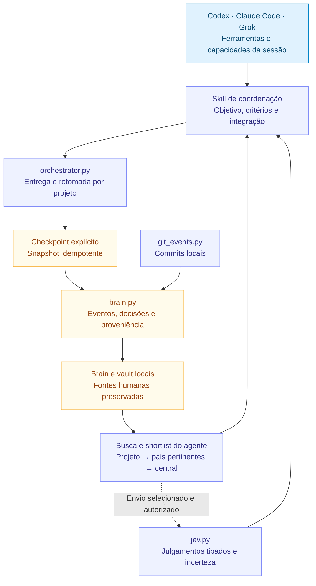

# HeBe Orchestrator: evolução a partir da rotina

Revisão de arquitetura: 2026-09-23. A versão **0.7.0** acrescenta rotina local para configuração, diagnóstico, entregas, retomada e checkpoints. O [README](../README.md#estado-da-versão) mantém o estado das capacidades; o [mapa vertical](MAPA-DO-PROJETO.md) mostra a sequência de trabalho.

O objetivo é concluir trabalho autorizado com evidência e conservar o contexto necessário à próxima sessão. O projeto/subprojeto é consultado primeiro. Agentes, modelos e serviços opcionais entram quando melhoram a entrega.

## Base da 0.7.0

| Componente | Responsabilidade implementada | Fronteira |
|---|---|---|
| `AGENTS.md` e bridge Claude | Contrato compartilhado e criação sem sobrescrever arquivos existentes | Presença no disco não comprova carregamento no host |
| `orchestrator.py` | Configurar central; diagnosticar; iniciar, consultar, atualizar, retomar, fazer checkpoint e fechar entrega | Não executa agentes, testes, push ou deploy |
| `brain.py` | Identidade, relações explícitas, eventos e materialização Markdown | Busca atual cobre eventos; prosa legada é consultada pelo agente |
| `git_events.py` | Observar commits locais por caminho | Não confirma push, não faz fetch e não mantém checkpoint Git |
| `jev.py` | Configuração protegida, catálogo e avaliação explícita | Seleção automática de contexto e reranking integrado são futuros |
| `project_context.py` e templates | Inspecionar contratos/configurações e preparar kit web quando pertinente | Preparar um kit não verifica o produto |
| Skill de coordenação | Plano, lotes de agentes, integração, evidência e revisão proporcional | Executa dentro das ferramentas, permissões e limites reais da sessão |

`configure` persiste a central; não inicializa o Brain. O runtime da entrega mantém uma entrega ativa por projeto e snapshots idempotentes por revisão. `close` exige critérios comprovados ou dispensados explicitamente, frentes concluídas e ausência de impedimentos. Dispensar altera o contrato e deve ser reportado; não é verificação aprovada. Entrega parcial permanece aberta para retomada.

## Estado junto da fonte

Os projetos mantêm `Brain.md`, vault e decisões existentes. O registro central localiza esses projetos e suas relações, sem copiar automaticamente todos os seus documentos. Worktrees podem consultar o UUID existente; descoberta de aliases e relocação automática ainda são futuras.

A configuração operacional fica fora do projeto, em `~/.config/hebe-brain/orchestrator.json`. A central escolhida mantém o registro/eventos em `.state/brain.sqlite3` e as entregas/checkpoints em `.state/orchestrator.sqlite3`. Esses arquivos ficam fora do Git padrão. Markdown é legível e portátil, mas não restaura sozinho o estado desses bancos.

As origens de eventos incluem Codex, Claude Code, Grok, Git e registro manual. Proposta, aceite, implementação, verificação, commit, push e publicação são eventos distintos. `decision.superseded` liga a decisão antiga à nova aceita com `supersedes` e `replacement`; não transforma uma proposta em decisão. `push.completed` e `publication.completed` exigem dados do destino/revisão e evidência correspondente. O schema está em [brain-and-github.md](../skills/orchestrate-models/references/brain-and-github.md).

## Evidência antes de automação

A unidade de qualidade é o critério da entrega. Código/API exige comportamento observado; documento, inspeção do render; dados, reconciliação; mídia, conferência do export; superfície web, jornada e inspeção visual, usando Playwright quando adequado. Achado material retorna à implementação e à verificação afetada.

Modelo, esforço e confiança declarada não substituem evidência. O coordenador registra o modelo efetivo ou herdado e mantém explícito o uso desconhecido. Revisões de alto risco usam o menor escopo útil; não iniciar auditoria ampla porque uma classificação sugeriu um rótulo. A skill `hebe-security-scan`, quando disponível e pertinente, é uma integração separada.

Jev pode reordenar uma shortlist pequena, classificar candidatos a memória e sugerir adequação entre opções elegíveis. O agente prepara a consulta explicitamente, confere as fontes e decide. Permissões, IDs, cálculos, escrita e execução ficam em código/ferramentas. `Choice`/`Score` incluem confiança; `Noul` retorna probabilidade. Limiares devem ser avaliados em consultas reais em português. Ver [TypeSafe/Jev](../skills/orchestrate-models/references/typesafe-jev.md).

## Evolução futura, sem ativação implícita

| Etapa futura | Benefício esperado | Evidência exigida antes de anunciar disponível |
|---|---|---|
| Backup/restauração completos | Recuperar identidade, eventos, entregas e documentos em outro ambiente | Restaurar em uma pasta limpa, conferir links/UUIDs e diferenças de caminhos locais |
| Sync GitHub explícito | Reduzir trabalho de envio dentro do escopo autorizado | Manifesto de arquivos, destino confirmado, conflitos preservados e revisão remota comprovada |
| Hooks e worker local | Capturar marcos nas fontes autorizadas entre sessões | Fila durável, replay após falha, cobertura/atraso visíveis e ausência de loops |
| Busca incremental e adapter Jev | Melhorar recuperação quando a busca local deixar lacunas | Comparação de acerto, tokens, latência e custo com/sem rerank no conteúdo real |
| Aliases de worktree e relocação | Manter identidade quando caminhos mudarem | Mesma identidade e fontes preservadas, sem misturar projetos homônimos |
| Runner Claude | Delegar jobs ao provedor conectado quando útil | CLI/SDK oficial, resultado estruturado, cancelamento, contexto mínimo e cobrança/limites observados |
| Escala de jobs | Sustentar muitas frentes quando houver demanda real | Slots respeitados, integração sem conflitos, custo por entrega e retomada após falha |

**Hooks, worker, sync, backup restaurável e runner Claude não estão ativos na 0.7.0.** Configurar um destino GitHub, manter um snapshot ou carregar um contrato portátil não comprova essas capacidades. Cada integração futura exige escopo, implementação e evidência própria.

### Backup e GitHub

Priorizar recuperação explícita antes de sincronização. Um índice central com links pode apontar para arquivos fora do repositório; copiar somente o índice não protege o conhecimento. O pacote de recuperação deve incluir manifestos, revisão, documentos selecionados e estado consistente dos dois bancos. Definir retenção, exclusão e verificação de restauração. Evitar duas fontes editáveis do mesmo documento.

Até essa etapa existir, o agente pode preparar um repositório e conduzir envios manuais autorizados com ferramentas disponíveis, informando exatamente o conjunto enviado. Não usar force-push ou `git add .` em raiz pessoal. Ver [GitHub](../skills/orchestrate-models/references/brain-and-github.md#sugerir-e-conectar-github).

### Captura entre hosts

Projetar hooks curtos que enfileirem eventos antes de trabalho demorado. Síntese, indexação e sync pertencem ao worker explícito. Usar IDs de origem, proveniência, aplicação idempotente e proteção contra autoalimentação. Transcrições são interfaces que podem mudar; adapters por host/versão devem mostrar lacunas de cobertura. Captura de Claude Code não implica acesso a Claude web/app, e uma skill instalada não concede confiança a hooks. [Hooks Codex](https://learn.chatgpt.com/docs/hooks), [hooks Claude Code](https://code.claude.com/docs/en/hooks).

### Provedores e escala

Preferir as ferramentas nativas de agentes. O catálogo do host define IDs, esforços e slots; novos nomes podem ser candidatos, sem troca automática por geração. Registrar desempenho observado antes de alterar preferências.

Um runner Claude futuro pode usar a CLI oficial ou Agent SDK. `claude mcp serve` oferece ferramentas e não substitui o runner do modelo. Conferir autenticação, plano e limites na instalação; não copiar credenciais para o Brain. Condições comerciais mudam e devem ser verificadas quando forem usadas. [Headless](https://code.claude.com/docs/en/headless), [MCP Claude](https://code.claude.com/docs/en/mcp#use-claude-code-as-an-mcp-server).

Muitos jobs devem ser lotes com dependências e integração responsável. Não implementar scheduler geral, múltiplos pools ou grafo de execução antes de observar uma necessidade que a rotina atual não resolva. Nunca criar processos para contornar limites do host.

## Critérios para avançar a versão

1. Retomar o projeto sem repetir escolhas já persistidas e sem criar outra entrega ativa.
2. Distinguir contrato presente, aplicável e carregamento desconhecido/observado.
3. Manter critérios, frentes, evidências, impedimentos e próximo passo após interrupção.
4. Recusar fechamento incompleto e reportar dispensas explicitamente, com justificativa.
5. Repetir checkpoint sem duplicar o mesmo estado e recuperar materialização interrompida.
6. Preservar contratos, Brains e configuração Playwright existentes.
7. Validar o pacote efetivamente instalado e identificar a revisão publicada separadamente.

Métricas úteis: critérios aceitos na primeira entrega, regressões, retomadas que dispensam reconstruir contexto, recuperação com fonte, atraso de consolidação e tempo total. Custo e tokens só são medidos quando o host os expõe. A quantidade de agentes é uma escolha operacional.
