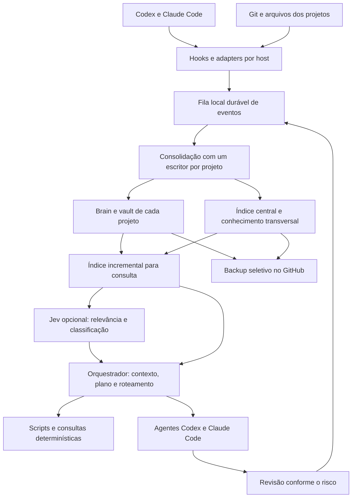

# HeBe Orchestrator: cérebro, execução e aprendizado

Data da investigação: 2026-09-23. Status: **arquitetura aprovada, contrato AGENTS.md, núcleo local, kit Playwright e conector explícito TypeSafe/Jev disponíveis na versão 0.6.0**. Estão implementados o contrato portátil por projeto, o registro de projetos/subprojetos, eventos em SQLite, consolidação Markdown, consulta local e coleta explícita de commits Git. A skill incorpora primeira configuração conversacional e metas por escopo. Captura contínua, worker permanente, sync GitHub, recuperação automática com Jev e runner Claude continuam sendo etapas posteriores. Consulte o README para o estado operacional desta versão e o [mapa do projeto](MAPA-DO-PROJETO.md) para a sequência de configuração.

Diretrizes do produto: sugerir GitHub no onboarding quando a integração faltar; manter Brain independente em cada projeto/subprojeto, consultado antes do geral; sugerir metas nativas para entregas compostas e só concluir com todos os critérios atendidos.

## Objetivo

Evoluir o orquestrador para coordenar trabalho, preservar conhecimento por produto, compartilhar contexto entre Codex e Claude Code e melhorar a escolha de ferramentas e modelos usando resultados observados. Conservar a estrutura do hebe-brain existente e oferecer instalação simples, com capacidades adicionais opcionais.

O desenho inclui: um Brain por projeto, um cérebro pessoal central, Obsidian opcional, backup GitHub, alimentação entre conversas, Jev para decisões e recuperação, catálogo de modelos atualizável, execução em grande volume e revisão de segurança proporcional ao risco.

## O que existe hoje

- Na investigação inicial, o plugin tinha manifesto, `orchestrate-models/SKILL.md` e metadados. A versão 0.4.0 acrescenta `scripts/brain.py` para armazenamento e consolidação local e `scripts/git_events.py` para coleta explícita de commits; ainda não há serviço permanente.
- Fonte da skill: [HericlisBezerra/hebe-brain](https://github.com/HericlisBezerra/hebe-brain), pasta `hebe-brain/`. Verificar versões e preservar instalações existentes; data de modificação sozinha não define a fonte correta.
- O hebe-brain define `Brain.md` como resumo/índice, notas atômicas como fonte e `vault/03-Decisoes/Registro-de-Decisoes.md` como decisões tomadas. A manutenção é um checklist ao final da sessão, sem coletor executável nos arquivos examinados.
- O visualizador HeBeBrain já permite navegar múltiplos Brains localmente e é independente de Obsidian. Sua distribuição é separada deste plugin; instalar a skill não instala o visualizador.
- A presença de Codex ou Claude Code não comprova que hooks estejam confiados, que uma ponte esteja ativa ou que modelos específicos estejam liberados. Conferir capacidades em cada instalação.
- A skill `hebe-security-scan` é uma integração opcional de revisão proporcional ao risco; este pacote não a inclui.
- `AGENTS.md` é o contrato portátil para Codex, Claude Code e Grok. `scripts/project_context.py` inicializa o contrato sem sobrescrever instruções e pode preparar um kit Playwright no produto alvo.

## Desenho proposto



### 1. Cérebro por projeto e cérebro central

Manter a informação junto de sua fonte, com um registro central para encontrá-la. Proposta de layout:

```text
<projeto>/
  Brain.md                         # resumo, estado atual e links
  vault/
    00-Indice.md
    03-Decisoes/Registro-de-Decisoes.md
    04-Engenharia/Commits.md        # somente se não existir equivalente
    ...                            # preservar convenções existentes

<HEBE_BRAIN_HOME>/                  # exemplo: ~/.codex/hebe-brain/
  Brain.md                         # visão pessoal transversal
  .state/brain.sqlite3              # implementação atual: IDs, raízes, eventos e checkpoints
  vault/                           # preferências e decisões globais
  backups/<project_id>/             # snapshots com origem e revisão
  .state/                          # estado local fora do envio Git padrão
```

O diretório central é configurável. Recomendar HeBeBrain para organização e visualização, preservando Obsidian existente se escolhido. Ambos podem usar a mesma base Markdown; Obsidian não é pré-requisito. Codex e Claude usam a mesma raiz configurada. Evitar dois cérebros centrais editáveis e não escrever na memória interna gerenciada pelos aplicativos.

Resolver o projeto por configuração explícita, marcadores locais e raiz Git, nesta ordem. A pasta corrente ajuda a localizar, mas não define a identidade: monorepos, subprojetos, worktrees, mudanças de caminho e projetos sem Git exigem um `project_id` estável. Um produto pode conter vários repositórios ligados por `product_id`.

Se um Brain já existir, adaptar seu formato. Se faltar, criar uma base mínima dentro do escopo configurado. Não criar vaults repetidos em cada subpasta ou worktree. No índice central, qualificar links com projeto/caminho para evitar colisões entre nomes como `Brain` e `Registro-de-Decisoes`.

### 2. Alimentação contínua com eventos

Uma skill pode orientar atualizações durante uma tarefa. Para continuar entre conversas e sobreviver ao fechamento do aplicativo, a proposta usa hooks curtos, uma fila persistente e um worker local. Hooks só enfileiram; síntese, indexação e sync ficam fora do caminho crítico da conversa.

Envelope mínimo de evento:

```json
{
  "schema_version": 1,
  "event_id": "idempotency-key",
  "project_id": "stable-project-id",
  "source": "codex|claude-code|git|manual",
  "session_id": "source-session-id",
  "source_event_id": "source-specific-id",
  "kind": "decision.proposed",
  "occurred_at": "ISO-8601",
  "source_ref": "conversation-or-commit-reference",
  "payload": {},
  "content_hash": "sha256"
}
```

Tipos úteis: proposta de decisão, decisão aceita/substituída, mudança implementada, verificação concluída, commit criado, push confirmado, revisão emitida e correção verificada. Diferenciar esses estados impede que uma ideia vire decisão ou que um commit local seja relatado como publicado.

Entrega pelo menos uma vez, aplicação idempotente, checkpoints e fila de falhas permitem recuperar eventos interrompidos. Um único escritor por projeto, transações e substituição atômica de documentos evitam corrupção com agentes concorrentes. O sistema deve excluir seus próprios artefatos derivados dos gatilhos e manter IDs de causalidade para evitar loops de autoalimentação.

O núcleo durável deve preservar proveniência e revisão. Quando uma decisão mudar, registrar a substituição; quando uma informação precisar ser apagada, aplicar a política de retenção também ao índice, snapshots e histórico elegível. Logs não podem tornar dados pessoais impossíveis de remover.

| Fonte | Integração proposta | Limite real |
|---|---|---|
| Codex local compatível | Hooks de sessão/turno/ferramenta e App Server quando necessário | Hooks precisam existir e estar confiados; cobertura varia por host |
| Claude Code | Hooks de turno/sessão e adapter CLI/SDK | Não equivale a acesso automático a chats do Claude web/app |
| Git | Reconciliação incremental dos repositórios registrados | Separar commit local de push/estado remoto comprovado |
| Chats sem eventos acessíveis | Importação/exportação ou conector documentado | Não prometer captura de todas as conversas |

No Codex, `transcript_path` é conveniência e seu formato não é uma interface estável. Preferir eventos estruturados e encapsular qualquer leitor de transcrição em um adapter versionado. Hooks em background podem ser cancelados ao encerrar a sessão; por isso, a fila deve ser gravada antes de disparar trabalho demorado. [Hooks Codex](https://learn.chatgpt.com/docs/hooks)

O onboarding deve mostrar cobertura e saúde: última captura, última consolidação, atraso, última sincronização, falhas e fontes desconectadas. “Sempre se alimenta” deve significar eventos recuperáveis nas fontes configuradas, com falhas visíveis.

### 3. Dados, Obsidian e GitHub

Markdown continua sendo o formato legível e portátil. SQLite é uma opção inicial para registro, fila e busca textual; embeddings ou grafo entram quando melhorarem consultas reais. Os índices são derivados e reconstruíveis.

Um repositório privado `hebe-brain` pode guardar conhecimento transversal e snapshots por projeto. A configuração precisa definir proprietário, repositório, escopo e política de envio. A captura pode ser automática dentro do escopo consentido sem reenviar toda conversa bruta. Segredos ficam fora de notas, prompts, índices e commits; metadados indicam onde uma credencial é gerenciada sem guardar seu valor.

Git versiona e permite cópias remotas, mas não substitui sozinho uma estratégia de recuperação: definir retenção e testar restauração de um projeto. Não usar `git add .` na raiz pessoal. Gerar um conjunto explícito de arquivos, validar destino, tratar conflito como conflito e evitar force-push automático.

Backups são cópias com origem identificada; a fonte do projeto permanece definida. Se o usuário quiser editar a réplica central, será necessário um modo separado de sincronização bidirecional, com controle de conflitos. Não ativá-lo implicitamente.

### 4. Jev como auxiliar de decisão

JEV refere-se ao **Jev da TypeSafe AI**, confirmado pela adoção de sua skill oficial. `scripts/jev.py` implementa configuração local, catálogo de modelos e avaliação explícita de arquivos JSON. A integração automática com a recuperação do Brain permanece planejada. Consulte o [contrato de uso](../skills/orchestrate-models/references/typesafe-jev.md).

Jev devolve escolhas, pontuações ou valores tipados a perguntas delimitadas. A integração mais útil combina busca local, uma seleção pequena de candidatos, avaliação Jev e raciocínio do agente com evidências. O Brain permanece a fonte persistente. [Introdução](https://docs.typesafe.ai/introduction), [coding agents](https://docs.typesafe.ai/introduction/coding-agents)

Prioridade de usos proposta:

1. Reordenar trechos recuperados e selecionar contexto relevante por projeto e tarefa.
2. Classificar candidatos a memória: decisão, fato, preferência, incidente ou conteúdo transitório.
3. Sinalizar duplicação, contradição, informação vencida ou decisão substituída.
4. Escolher entre ferramentas/skills elegíveis e sugerir escalonamento de um job.
5. Ajudar a reconciliar entidades e priorizar hipóteses de negócio; cálculos ficam em SQL/Python e conclusões referenciam dados.

Existem receitas oficiais para [RAG](https://docs.typesafe.ai/cookbooks/classifying_rag_passages), [entidades](https://docs.typesafe.ai/cookbooks/entity_alignment) e [seleção de skills](https://docs.typesafe.ai/cookbooks/skill_suggestion). O [experimento de reranking](https://docs.typesafe.ai/cookbooks/rerank_typesafe) é evidência para experimentar, não um benchmark do nosso Brain. O [Jev-Mem](https://arxiv.org/abs/2609.23986), recém-publicado, também deve ser tratado como pesquisa.

O conector inicial envia `state`, `questions` e `model` ao endpoint oficial `/v1/systemone` por solicitação explícita. Uma camada futura de orquestração adicionará `allowed_actions`, orçamento, cache por conteúdo/modelo/rubrica e fallback local; esses campos de política não pertencem ao contrato HTTP do TypeSafe. Filtrar autorização e projetos antes de enviar candidatos: uma resposta de modelo nunca concede acesso ou permissão de publicação.

Na pesquisa, `jev-1.13.0` tem contexto total de 64k, com limite de 32k para `state` mais a maior pergunta; é texto somente. O preço publicado é US$ 0,042 por milhão de tokens de entrada, sem cobrança de saída. Esses números são um snapshot; consultar o catálogo no uso. [Modelos](https://docs.typesafe.ai/models)

A API é um serviço externo. A política diz que não treina com os inputs, mas isso não significa retenção zero; ZDR tem condições específicas. Enviar apenas trechos permitidos pela configuração. Há limitações documentadas em matemática, datas, raciocínio indireto, contexto irrelevante e conteúdo adversarial. [Limitações](https://docs.typesafe.ai/model-jaggedness/jev-1.13), [privacidade](https://typesafe.ai/legal/privacy-policy), [retenção](https://docs.typesafe.ai/legal)

### 5. Roteamento por capacidade e resultado

Substituir uma hierarquia universal de nomes por perfis de tarefa. As preferências relatadas pelo usuário são um ponto de partida configurável, não equivalências medidas entre fornecedores.

| Perfil | Preferência inicial proposta | Critério para escolher |
|---|---|---|
| Operação determinística | Script, SQL ou ferramenta | Resultado reproduzível sem interpretação |
| Classificação curta | Jev opcional ou modelo focado disponível | Qualidade, cobertura, latência e custo medidos |
| Engenharia | GPT-6 Sol; candidatos Claude habilitados | Correção, autonomia e retrabalho |
| Design e direção visual | GPT-6 Astra; candidatos Claude habilitados | Avaliação visual no produto e referências |
| Pesquisa e decisão complexa | Modelo forte elegível | Evidência, consistência e impacto |
| Revisão de alto risco | Revisor independente com capacidade adequada | Cenário concreto, cobertura e validação |

Orquestrar vídeo significa escolher ferramentas de produção, montar o fluxo e avaliar resultados. Não pressupor geração nativa de vídeo por um modelo apenas por sua qualidade em direção visual.

Registrar para cada job: modelo solicitado e efetivo, esforço, host, perfil, latência, uso conhecido, custo estimado identificado como tal, revisões, falhas e aceitação. “Mais novo” é candidato a upgrade; “melhor para esta tarefa” exige evidência. Modelos anteriores, como Terra, podem permanecer elegíveis quando disponíveis e competitivos. Eles continuam consumindo inferência.

No Codex, `model/list` fornece modelos disponíveis, esforços, modalidades e campos opcionais `upgrade`/`upgradeInfo`. É a base para sugerir uma nova geração quando ela aparecer na conta. Usar o catálogo observado, sem fabricar slugs GPT-7/8/9. Manter cache com data, última configuração válida e rollback. [App Server](https://learn.chatgpt.com/docs/app-server)

Separar atualização de catálogo e de código do plugin: novos IDs podem ser descobertos sem reescrever a skill; novos protocolos e capacidades podem exigir uma versão nova. Adoção automática deve ser uma política configurável; o padrão proposto é sugerir o upgrade e promover após uma pequena avaliação representativa. Não criar uma automação recorrente nesta fase de desenho.

### 6. Claude Code dentro do Codex

Um adapter `ClaudeCodeProvider` pode chamar a CLI oficial autenticada (`claude -p`) ou o Agent SDK e devolver resultados estruturados ao coordenador. A configuração identifica assinatura versus API e o orçamento correspondente. Não copiar tokens OAuth para outro provedor nem para o Brain.

A documentação consultada diz que `-p`/SDK continuam usando os limites da assinatura após a pausa de uma mudança de cobrança. Essa condição deve ser revalidada no onboarding. `--bare` ignora autenticação OAuth/keychain, portanto não serve como modo automático para a ponte baseada na assinatura. [Headless](https://code.claude.com/docs/en/headless), [uso do SDK com plano Claude](https://support.claude.com/en/articles/15036540-use-the-claude-agent-sdk-with-your-claude-plan)

`claude mcp serve` oferece ferramentas; não fornece, por si só, a delegação ao modelo Claude. Um MCP da ponte envolve o runner e expõe jobs com status, cancelamento e resultado. [MCP Claude](https://code.claude.com/docs/en/mcp#use-claude-code-as-an-mcp-server)

Foram encontrados os projetos terceiros [xavierchoi/claude-plugin-codex](https://github.com/xavierchoi/claude-plugin-codex) e [davidq888/claude-code-codex-plugin](https://github.com/davidq888/claude-code-codex-plugin). São referências e candidatos; seus READMEs não constituem auditoria nem validação operacional. Preferência de engenharia: adapter estreito sobre a interface oficial, reutilizando código externo apenas após revisar licença, escopo e execução de comandos.

A documentação atual lista Opus 5.5, Sonnet 5 e Fable 5.1. Isso não prova equivalência com modelos OpenAI ou acesso em todo plano. Descoberta da API e acesso pela assinatura são coisas distintas; conferir a CLI instalada e as capacidades da sessão. [Configuração de modelos](https://code.claude.com/docs/en/model-config)

### 7. Escala e concorrência

O scheduler deve aceitar muitas tarefas, modelar dependências e distribuir jobs em pools por provedor, com cancelamento, backoff, prazo e orçamento. Usar DAGs para dependências e agrupamento por área/arquivo para evitar conflitos. Agentes só devem permanecer ativos enquanto têm trabalho independente útil.

Consultar o limite de slots exposto pelo host, incluindo o coordenador quando aplicável. A skill não aumenta esse limite. A configuração documentada do Codex inclui `agents.max_concurrent_threads_per_session`, mas o valor efetivo depende do ambiente. [Subagents](https://learn.chatgpt.com/docs/agent-configuration/subagents)

O alvo útil é sustentar 80 ou mais **jobs** com rastreabilidade. O número simultâneo deve se adaptar à disponibilidade real, orçamento, CPU/memória, conflitos de arquivos e limites do provedor. Não criar processos extras para contornar uma limitação do host. A documentação de Claude Teams recomenda começar pequeno e aponta limitações operacionais. [Agent teams](https://code.claude.com/docs/en/agent-teams)

Para jobs que editam, usar isolamento por worktree quando adequado e um integrador responsável pelo merge. Para memória, todos emitem eventos e um escritor consolida. Para copiar, extrair, calcular, indexar ou processar grandes listas, preferir execução determinística quando suficiente.

### 8. Revisão e segurança

Revisão comum pode usar a capacidade de review disponível no host. Não tratar `/review` como uma API universal nem como substituto da análise de segurança específica.

Proposta de gatilhos para `hebe-security-scan`: alterações que atinjam autenticação, permissões, isolamento entre clientes, pagamentos, webhooks, segredos, uploads ou APIs públicas. Um classificador ajuda a mapear risco, mas regras determinísticas e julgamento do coordenador impedem que um score baixo suprima uma revisão necessária.

Aplicar o menor modo útil definido pela skill: Change no diff; Release na entrega iminente; Baseline quando solicitado ou necessário para estabelecer cobertura. Ler decisões do projeto antes de classificar trade-offs aceitos. O revisor é somente leitura por padrão, não audita produção por conta própria e não recebe permissão de correção automaticamente.

Salvar achados com revisão Git, evidência, cobertura e status. Uma correção deve invalidar apenas as partes relevantes da revisão; não repetir toda a auditoria em cada edição. Agendar o review como dependência da entrega de alto risco e registrar seu resultado no Brain. Modelo alternativo pode ampliar a revisão, mas discordância exige evidências e adjudicação.

## Ordem recomendada e critérios de entrega

| Etapa | Entrega | Critério observável |
|---|---|---|
| 1. Núcleo de memória | Resolver projetos, adotar hebe-brain existente, eventos e consolidação local | Repetir um evento não duplica notas; dois projetos homônimos não se misturam; decisão aponta para a fonte |
| 2. Captura por host | Hooks Codex/Claude Code, fila persistente e painel de saúde | Retomar após falha recupera eventos; fontes não cobertas aparecem como tal; nenhuma conversa precisa reescrever o vault inteiro |
| 3. Provedores e modelos | Catálogo dinâmico, runner Claude e orçamento por provedor | Novo modelo vira sugestão; ausência do modelo mantém fallback conhecido; cancelamento encerra o job |
| 4. Recuperação e Jev | Busca incremental, shortlist, adapter opcional e métricas | Comparar acerto de recuperação, tokens e latência com e sem Jev em consultas reais em português |
| 5. GitHub e Obsidian | Backup explícito, namespaces, conflitos e restauração | Restaurar um projeto e seus links; falha de sync não perde eventos; conjunto publicado é inspecionável |
| 6. Escala e review | Scheduler de muitos jobs, integração isolada e gatilhos de segurança | Nenhuma escrita concorrente corrompe documentos; limites efetivos são respeitados; cobertura da revisão acompanha o diff |

Começar pelo núcleo local e contratos; adicionar inteligência sobre uma base com fontes e estados confiáveis. Projetar testes para perdas/duplicação, concorrência, isolamento, reconexão e cancelamento. Métricas prioritárias: qualidade aceita na primeira entrega, regressões, recuperação com evidência, atraso de consolidação, custo por entrega e tempo total. A quantidade de agentes é uma configuração operacional.

## Metas e conclusão do escopo

Codex e Claude Code documentam `/goal`. O orquestrador propõe uma meta concreta com objetivo, entregáveis, critérios de conclusão, evidências e dependências. A criação nativa ocorre após pedido ou aceitação explícita, respeitando o contrato do host. O plano persistente vive no projeto; o Brain central guarda apenas as relações pertinentes.

Durante a execução, avançar nas frentes independentes e registrar evidências. Só considerar a entrega concluída quando todos os critérios estiverem atendidos. Pausa, cancelamento, bloqueio, limite de uso e necessidade de entrada permanecem estados distintos. Uma meta não amplia permissões, limites ou cobertura entre aplicativos. Ver [delivery-goals.md](../skills/orchestrate-models/references/delivery-goals.md) para os adapters.

## Escolhas por instalação

- Provedor Jev, quando habilitado.
- Raiz central e interface: HeBeBrain recomendado, Obsidian existente ou ambos.
- Repositório privado e política de backup/publicação por projeto.
- Orçamentos por provedor e possibilidade de enviar trechos selecionados a Jev.
- Quais superfícies entram na primeira entrega: Codex local e Claude Code são o recorte recomendado.

Essas escolhas não impedem o desenho do núcleo. Tornam-se entradas concretas do onboarding antes de ativar captura global ou envio de dados.

## Referências locais de implementação

- `skills/orchestrate-models/SKILL.md` e `.codex-plugin/plugin.json` deste plugin.
- [Skill hebe-brain](https://github.com/HericlisBezerra/hebe-brain/tree/main/hebe-brain): estrutura, decisões, notas, links e manutenção.
- `scripts/brain.py` e `scripts/git_events.py`: núcleo local e coleta Git.
- Skill `hebe-security-scan` instalada no host, quando disponível: escopo, modos e revisão proporcional.
- [Empacotamento e hooks de plugins Codex](https://developers.openai.com/plugins/build/plugins): hooks precisam estar disponíveis e confiados; instalar o plugin não concede confiança automaticamente.
- [Hooks Claude Code](https://code.claude.com/docs/en/hooks): eventos para captura local; handlers devem enfileirar rapidamente.

Pesquisa executada em frentes independentes (hebe-brain, Jev, Claude bridge), integrada com inspeção do plugin e documentação oficial. A versão 0.6.0 inclui o conector TypeSafe/Jev; cada instalação depende de sua própria credencial. Configurar o acesso consulta o catálogo de modelos e não envia notas. Nenhum envio contínuo de conteúdo ou sincronização externa é ativado pela instalação.
